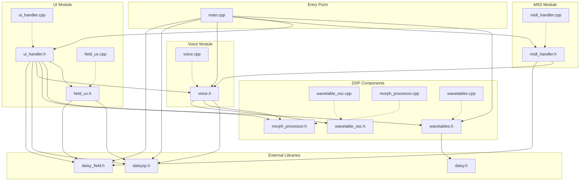

# File Dependencies - Field Wavetable Morph Synth

## Dependency Flowchart

**Legend:**
- **Solid arrows (→)**: `#include` dependency
- **Dashed arrows (⤏)**: Implementation includes its header

---

## Dependency Table

| File | Dependencies |
|------|--------------|
| `main.cpp` | `daisy_field.h`, `daisysp.h`, `voice.h`, `ui_handler.h`, `midi_handler.h`, `wavetables.h` |
| `voice.h` | `wavetable_osc.h`, `morph_processor.h`, `daisysp.h` |
| `ui_handler.h` | `daisy_field.h`, `daisysp.h`, `voice.h`, `morph_processor.h`, `wavetables.h`, `field_ux.h` |
| `midi_handler.h` | `daisy_field.h`, `voice.h` |
| `wavetables.h` | `daisy.h` |
| `field_ux.h` | `daisy_field.h`, `daisysp.h` |
| `wavetable_osc.h` | `<stdint.h>` only |
| `morph_processor.h` | `<stdint.h>` only |
