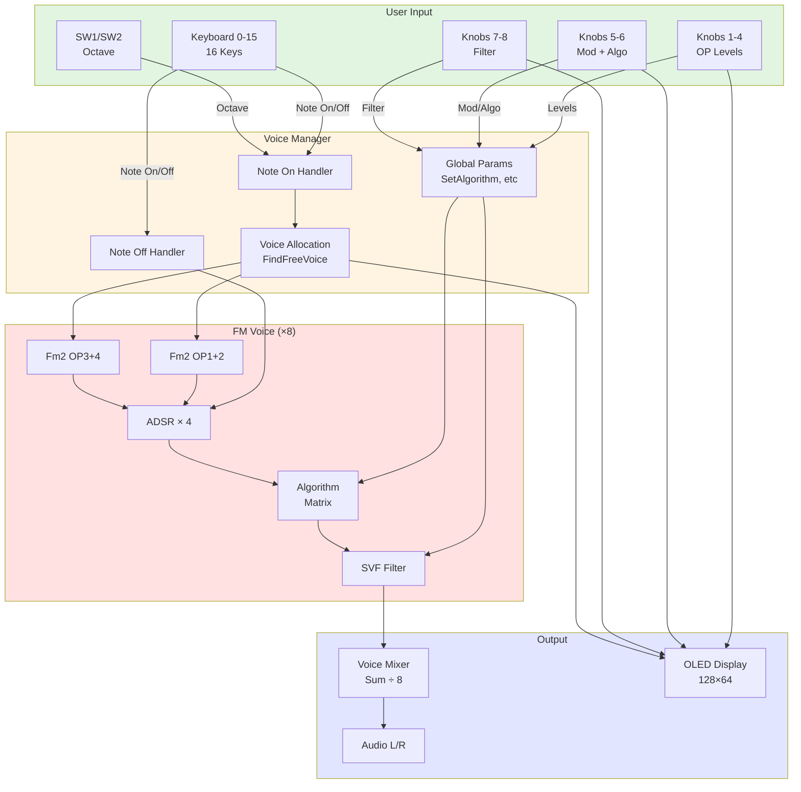

# FM Synthesizer Block Diagrams & Architecture

**Project**: fm_synth_field  
**Platform**: Daisy Field  
**Date**: 2026-01-04

---

## Signal Flow (Audio Path)

```
┌─────────────────────────────────────────────────────────────────────────────┐
│ AUDIO SIGNAL FLOW                                                            │
├─────────────────────────────────────────────────────────────────────────────┤
│                                                                              │
│  ┌──────────────┐    ┌──────────────┐    ┌──────────────┐    ┌───────────┐  │
│  │  KEYBOARD    │───►│ VOICE MGR    │───►│  8 FM VOICES │───►│  MIXER    │  │
│  │  (16 keys)   │    │ (Allocate)   │    │              │    │  (Sum)    │  │
│  └──────────────┘    └──────────────┘    └──────┬───────┘    └─────┬─────┘  │
│         ▲                   ▲                    │                  │        │
│         │                   │                    ▼                  ▼        │
│     Note On/Off        Octave Shift     ┌───────────────┐  ┌─────────────┐  │
│    (Rising/Falling)      (SW1/SW2)      │  PER VOICE:   │  │   OUTPUT    │  │
│                                          │               │  │    L / R    │  │
│                                          │  Fm2 (OP1+2)  │  └─────────────┘  │
│                                          │  Fm2 (OP3+4)  │                   │
│                                          │  ADSR × 4     │                   │
│                                          │  Algorithm    │                   │
│                                          │  SVF Filter   │                   │
│                                          └───────────────┘                   │
│                                                                              │
└─────────────────────────────────────────────────────────────────────────────┘
```

---

## Control Flow (Parameter Processing)

```
┌─────────────────────────────────────────────────────────────────────────────┐
│ CONTROL / PARAMETER FLOW                                                     │
├─────────────────────────────────────────────────────────────────────────────┤
│                                                                              │
│  ┌────────────┐                                 ┌────────────────────┐      │
│  │  KNOBS 1-8 │────► ProcessAnalogControls() ──►│  Voice Manager     │      │
│  └────────────┘                                 │  Global Params:     │      │
│        │                                        │                     │      │
│        ├─► K1-K4: Operator Levels ────────────►│  - OP Levels[4]    │      │
│        ├─► K5: Mod Index (0-10) ──────────────►│  - Mod Index       │      │
│        ├─► K6: Algorithm (0-7) ───────────────►│  - Algorithm       │      │
│        ├─► K7: Filter Cutoff ─────────────────►│  - Filter Cutoff   │      │
│        └─► K8: Resonance ─────────────────────►│  - Filter Res      │      │
│                                                 └────────────────────┘      │
│  ┌────────────┐                                          │                  │
│  │ SW1 / SW2  │────► ProcessDigitalControls() ──────────►│                  │
│  └────────────┘                                          │                  │
│        │                                                 ▼                  │
│        ├─► SW1: Octave Down (-1) ────────► octave_offset (-2 to +2)        │
│        └─► SW2: Octave Up (+1)                                             │
│                                                                              │
│  ┌────────────────────────────────────────────────────────────────┐         │
│  │              OLED DISPLAY LOGIC                                 │         │
│  │                                                                 │         │
│  │  CheckParameterChanges() ───► if change detected:              │         │
│  │      - Set zoomParam (knob index)                              │         │
│  │      - Start 1.2s timer                                        │         │
│  │                                                                 │         │
│  │  UpdateOLED() ───► if zoomParam != -1:                         │         │
│  │      DrawZoomedParameter()  (large text + bar)                 │         │
│  │  else:                                                          │         │
│  │      DrawDefaultView()  (algo, voices, octave, OP levels)      │         │
│  └────────────────────────────────────────────────────────────────┘         │
│                                                                              │
└─────────────────────────────────────────────────────────────────────────────┘
```

---

## FM Voice Architecture (Per Voice)

```
┌─────────────────────────────────────────────────────────────────────────────┐
│ FM VOICE INTERNAL STRUCTURE                                                  │
├─────────────────────────────────────────────────────────────────────────────┤
│                                                                              │
│  Note On ──► base_freq = mtof(note + octave×12)                             │
│       │                                                                      │
│       ▼                                                                      │
│  ┌──────────────────────────────────────────────────────────────────┐       │
│  │  OPERATOR BANK                                                    │       │
│  │                                                                   │       │
│  │  ┌──────────────┐          ┌──────────────┐                      │       │
│  │  │ Fm2 (Pair 1) │          │ Fm2 (Pair 2) │                      │       │
│  │  │ OP1 + OP2    │          │ OP3 + OP4    │                      │       │
│  │  │ Ratio: var   │          │ Ratio: var   │                      │       │
│  │  │ Index: var   │          │ Index: var   │                      │       │
│  │  └──────┬───────┘          └──────┬───────┘                      │       │
│  │         │                          │                              │       │
│  │         ▼                          ▼                              │       │
│  │  ┌──────────────┐          ┌──────────────┐                      │       │
│  │  │ ADSR Env 1,2 │          │ ADSR Env 3,4 │                      │       │
│  │  │ A: 5ms       │          │ A: 5ms       │                      │       │
│  │  │ D: 100ms     │          │ D: 100ms     │                      │       │
│  │  │ S: 70%       │          │ S: 70%       │                      │       │
│  │  │ R: 300ms     │          │ R: 300ms     │                      │       │
│  │  └──────┬───────┘          └──────┬───────┘                      │       │
│  │         │                          │                              │       │
│  │         └────────┬─────────────────┘                              │       │
│  │                  │                                                │       │
│  │                  ▼                                                │       │
│  │         ┌────────────────────┐                                   │       │
│  │         │ ALGORITHM MATRIX   │                                   │       │
│  │         │ (switch/case 0-7)  │                                   │       │
│  │         │                    │                                   │       │
│  │         │ 0: Stack           │                                   │       │
│  │         │ 1: Parallel        │                                   │       │
│  │         │ 2: 2+2 Split       │                                   │       │
│  │         │ 3: Harmonic        │                                   │       │
│  │         │ 4: Bell            │                                   │       │
│  │         │ 5: Brass           │                                   │       │
│  │         │ 6: E-Piano         │                                   │       │
│  │         │ 7: Bass            │                                   │       │
│  │         └────────┬───────────┘                                   │       │
│  │                  │                                                │       │
│  │                  ▼                                                │       │
│  │         ┌────────────────────┐                                   │       │
│  │         │   SVF FILTER       │                                   │       │
│  │         │   Lowpass          │                                   │       │
│  │         │   Cutoff: K7       │                                   │       │
│  │         │   Res: K8          │                                   │       │
│  │         └────────┬───────────┘                                   │       │
│  │                  │                                                │       │
│  │                  ▼                                                │       │
│  │         Velocity Scaling (vel/127)                               │       │
│  │                  │                                                │       │
│  │                  ▼                                                │       │
│  │            Voice Output                                          │       │
│  └──────────────────────────────────────────────────────────────────┘       │
│                                                                              │
└─────────────────────────────────────────────────────────────────────────────┘
```

---

## Voice Manager State Machine

```
┌─────────────────────────────────────────────────────────────────────────────┐
│ VOICE ALLOCATION STATE MACHINE                                               │
├─────────────────────────────────────────────────────────────────────────────┤
│                                                                              │
│                       Note On Event                                          │
│                            │                                                 │
│                            ▼                                                 │
│                  ┌──────────────────┐                                        │
│                  │  FindFreeVoice() │                                        │
│                  └────────┬─────────┘                                        │
│                           │                                                  │
│              ┌────────────┴────────────┐                                     │
│              │                         │                                     │
│              ▼                         ▼                                     │
│      ╔═══════════════╗         ╔═══════════════╗                            │
│      ║ Voice Found   ║         ║ No Free Voice ║                            │
│      ╚═══════┬═══════╝         ╚═══════════════╝                            │
│              │                         │                                     │
│              ▼                         ▼                                     │
│      ┌──────────────────┐         (Return NULL                              │
│      │ Activate Voice   │          Voice dropped)                           │
│      │ - Set note       │                                                   │
│      │ - Set velocity   │                                                   │
│      │ - Set active=1   │                                                   │
│      │ - Set gate=1     │                                                   │
│      └────────┬─────────┘                                                   │
│               │                                                              │
│               ▼                                                              │
│      ┌──────────────────┐                                                   │
│      │ Voice Processing │                                                   │
│      │ (Every sample)   │                                                   │
│      └────────┬─────────┘                                                   │
│               │                                                              │
│               │                Note Off Event                               │
│               │                      │                                       │
│               │                      ▼                                       │
│               │              ┌──────────────────┐                           │
│               │              │ Find matching    │                           │
│               │              │ active voice     │                           │
│               │              │ (by note number) │                           │
│               │              └────────┬─────────┘                           │
│               │                       │                                      │
│               │                       ▼                                      │
│               │              ┌──────────────────┐                           │
│               └─────────────►│ Set gate = 0     │                           │
│                              │ (Start release)  │                           │
│                              └────────┬─────────┘                           │
│                                       │                                      │
│                                       ▼                                      │
│                              ┌──────────────────┐                           │
│                              │ Wait for env to  │                           │
│                              │ finish release   │                           │
│                              └────────┬─────────┘                           │
│                                       │                                      │
│                                       ▼                                      │
│                              ┌──────────────────┐                           │
│                              │ Set active = 0   │                           │
│                              │ (Voice freed)    │                           │
│                              └──────────────────┘                           │
│                                                                              │
└─────────────────────────────────────────────────────────────────────────────┘
```

---

## Mermaid Diagram (Interactive View)



---

## Algorithm Routing Examples

### Algorithm 0: Stack
```
 OP1 (1:1)
    ↓ mod
 OP2 (via Fm2)
    ↓
  Output
```

### Algorithm 1: Parallel
```
 OP1 (1:1)    OP3 (2:1)
    ↓            ↓
    └─────┬──────┘
          ↓
       Output
```

### Algorithm 4: Bell (DX7-style)
```
 OP1 (1.4:1)    OP3 (3.5:1)
    ↓              ↓ (×0.3)
    └──────┬───────┘
           ↓
        Output
```

---

## OLED Display State Machine

```
┌─────────────────────────────────────────────────────────────────────────────┐
│ OLED VISUALIZATION STATE MACHINE                                             │
├─────────────────────────────────────────────────────────────────────────────┤
│                                                                              │
│         CheckParameterChanges() (every 16ms)                                 │
│                    │                                                         │
│                    ▼                                                         │
│        ┌────────────────────┐                                               │
│        │ Any knob changed   │                                               │
│        │ by > 2%?           │                                               │
│        └──────┬─────────────┘                                               │
│               │                                                              │
│         ┌─────┴─────┐                                                       │
│         │           │                                                        │
│         NO         YES                                                       │
│         │           │                                                        │
│         │           ▼                                                        │
│         │     ┌────────────────┐                                            │
│         │     │ Set zoomParam  │                                            │
│         │     │ Start 1.2s tmr │                                            │
│         │     └────────┬───────┘                                            │
│         │              │                                                     │
│         │              ▼                                                     │
│         │       ╔═════════════╗                                             │
│         │       ║ ZOOM MODE   ║                                             │
│         │       ╚══════┬══════╝                                             │
│         │              │                                                     │
│         │              ▼                                                     │
│         │     ┌─────────────────────┐                                       │
│         │     │ DrawZoomedParameter │                                       │
│         │     │ - Param name        │                                       │
│         │     │ - Large value       │                                       │
│         │     │ - Progress bar      │                                       │
│         │     └─────────┬───────────┘                                       │
│         │               │                                                    │
│         │               ▼                                                    │
│         │     ┌─────────────────────┐                                       │
│         │     │ Timer expired?      │                                       │
│         │     └──────┬──────────────┘                                       │
│         │            │                                                       │
│         │           YES                                                      │
│         │            │                                                       │
│         │            ▼                                                       │
│         │     ┌─────────────────────┐                                       │
│         │     │ Clear zoomParam     │                                       │
│         │     └──────┬──────────────┘                                       │
│         │            │                                                       │
│         └────────────┴──────────────┐                                       │
│                      │               │                                       │
│                      ▼               │                                       │
│               ╔═════════════╗        │                                       │
│               ║ DEFAULT MODE║────────┘                                       │
│               ╚══════┬══════╝                                               │
│                      │                                                       │
│                      ▼                                                       │
│             ┌─────────────────────┐                                         │
│             │ DrawDefaultView     │                                         │
│             │ - Title             │                                         │
│             │ - Algorithm name    │                                         │
│             │ - Active voices     │                                         │
│             │ - Octave offset     │                                         │
│             │ - OP levels         │                                         │
│             └─────────────────────┘                                         │
│                                                                              │
└─────────────────────────────────────────────────────────────────────────────┘
```

---

## Performance Specs

| Metric | Value |
|--------|-------|
| **Polyphony** | 8 voices |
| **Sample Rate** | 48 kHz |
| **CPU Load** | ~70% (estimated) |
| **Latency** | <2ms (audio buffer) |
| **OLED Update** | 60 FPS (~16ms) |
| **RAM Usage** | ~15 KB (voice structures) |

---

## Quick Reference

### Keyboard Layout
```
Row A: C  C# D  D# E  F  F# G  G# A  A# B  C  C# D  D#
Keys:  0  1  2  3  4  5  6  7  8  9  10 11 12 13 14 15
```

### Algorithm Quick Select
- **K6 = 0%**: Stack (classic FM)
- **K6 = 25%**: 2+2 Split
- **K6 = 50%**: Bell
- **K6 = 75%**: E-Piano
- **K6 = 100%**: Bass

---

**Created**: 2026-01-04  
**Version**: 1.0  
**Platform**: Daisy Field
