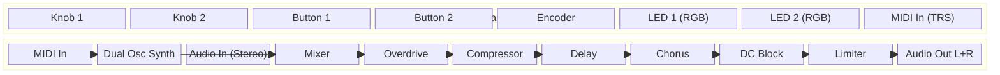
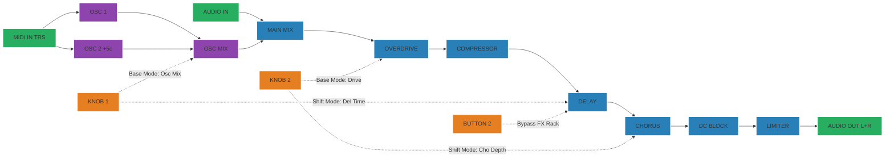

# Multi-FX Synth Pod — Controls Documentation

## A. System Architecture

## B. Signal Flow

## C. Parameter Mapping

### Hardware Controls

| Control | Mode | Function | Range / Notes |
|---------|------|----------|---------------|
| **Button 1** | Global | Toggle Shift Mode | Switches between Base (Blue) and Shift (Green) mode |
| **Button 2** | Global | Toggle FX Bypass | Bypasses Drive, Comp, Delay, and Chorus. |
| **Knob 1** | Base | Osc Blend | Crossfades between Osc 1 and Osc 2 (linear) |
| **Knob 2** | Base | Drive | Saturation amount (0 to Max Drive) |
| **Knob 1** | Shift | Delay Time | 50ms to 800ms |
| **Knob 2** | Shift | Chorus Depth | LFO Modulation Depth (0.0 to 1.0) |

### LED Indicators

| Component | State | Meaning |
|-----------|-------|---------|
| **LED 1** | Blue | Base Mode Active (Knobs edit Synth and Drive) |
| **LED 1** | Green | Shift Mode Active (Knobs edit Delay and Chorus) |
| **LED 2** | OFF | FX Rack Bypassed |
| **LED 2** | Blue / Green | FX Rack Active (color matches LED 1 to indicate current mode) |

## D. Voice Architecture

The synthesizer consists of a dual-oscillator voice triggered via MIDI.

- **Oscillators**: Two High-quality Saw waveforms.
- **Detune**: Osc 2 is offset internally by +5 cents for a thicker sound.
- **Envelope**: Plucked ADSR envelope (A:10ms, D:100ms, S:80%, R:200ms) mapped to output amplitude.

## E. FX Rack Architecture

The FX rack processes a mono sum of the synth voices and external hardware inputs, returning a stereo-spatialised output post-Chorus.

`Audio In L+R + Synth Mix -> Overdrive -> Compressor -> Delay -> Chorus (Stereo) -> Limiter -> Output`
