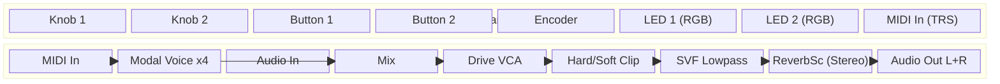
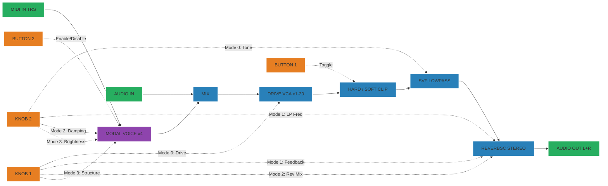
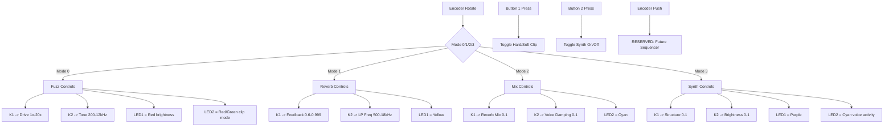

# Pod Fuzz Distortion — Controls Documentation

## A. System Architecture

## B. Signal Flow

## C. Control Flow

## Parameter Mapping

### Encoder Modes

| Mode | LED Indicator | Knob 1 | Range | Knob 2 | Range |
|------|---------------|--------|-------|--------|-------|
| 0 — Fuzz | LED1 Red | Drive (Gain) | 1x - 20x (linear) | Tone (Cutoff) | 200 Hz - 12 kHz (log) |
| 1 — Reverb | LED1 Yellow | Feedback | 0.6 - 0.999 | LP Freq | 500 Hz - 18 kHz (log) |
| 2 — Mix | LED2 Cyan | Reverb Mix (Dry/Wet) | 0.0 - 1.0 | Voice Damping | 0.0 - 1.0 |
| 3 — Synth | LED1 Purple | Structure | 0.0 - 1.0 | Brightness | 0.0 - 1.0 |

### Buttons

| Button | Function | Indicator |
|--------|----------|-----------|
| Button 1 | Toggle clip mode | LED2 (mode 0): Red = Hard, Green = Soft |
| Button 2 | Toggle synth on/off | LED2 (mode 3): Cyan = On, Dim Red = Off |
| Encoder Push | RESERVED | Future sequencer implementation |

### Default Values

| Parameter | Default |
|-----------|---------|
| Drive | 1.0x (clean) |
| Tone | 2000 Hz |
| Clip Mode | Hard |
| Feedback | 0.85 |
| LP Freq | 10000 Hz |
| Reverb Mix | 0.5 |
| Structure | 0.5 |
| Brightness | 0.5 |
| Damping | 0.5 |
| Synth | Enabled |

## Voice Architecture

The synth uses a modular `Voice` interface (`voice.h`) for swappable voice implementations.

**Current voice**: `ModalSynth` — 4-voice polyphonic modal synthesis (ModalVoice resonators)

- Mallet exciter: click -> LPF -> resonator (Plaits-derived)
- Triggered (not gated) — natural decay via Damping parameter
- Round-robin voice allocation with free-voice preference
- Per-sample `fonepole()` smoothing on Structure and Brightness
- Velocity-sensitive accent

**To swap voices**: See instructions in `voice.h`
