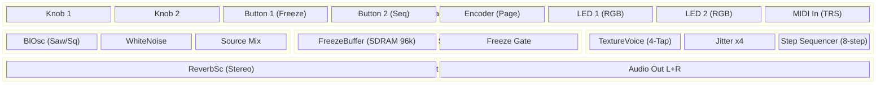
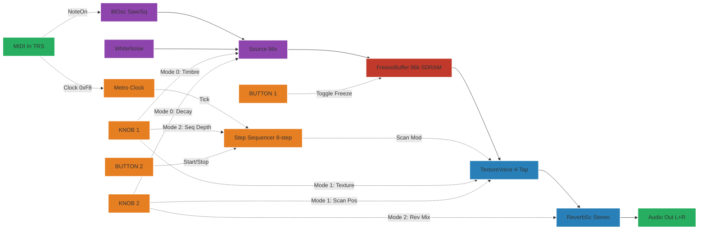
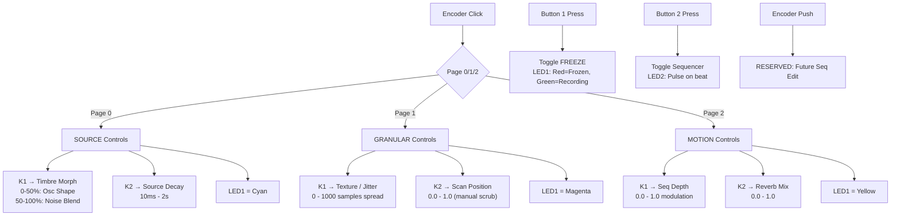

# Nebula-Resonator — Controls Documentation

## A. System Architecture

## B. Signal Flow

## C. Control Flow

## Parameter Mapping

### Encoder Modes (3-Page FSM)

| Mode | LED1 Color | Knob 1 | Range | Knob 2 | Range |
|------|------------|--------|-------|--------|-------|
| 0 — Source | Cyan | Timbre Morph | 0-50% Osc shape (Saw→Sq), 50-100% Noise blend | Source Decay | 10ms - 2s (envelope) |
| 1 — Granular | Magenta | Texture (Jitter) | 0 - 1000 samples spread | Scan Position | 0.0 - 1.0 (manual scrub) |
| 2 — Motion | Yellow | Seq Depth | 0.0 - 1.0 (seq → scan mod) | Reverb Mix | 0.0 - 1.0 (dry/wet) |

### Buttons

| Button | Function | LED Indicator |
|--------|----------|---------------|
| Button 1 | FREEZE toggle (lock/unlock buffer) | LED1: Red = Frozen, Green = Recording |
| Button 2 | Sequencer Start/Stop | LED2: Pulse on beat when running |
| Encoder Push | RESERVED | Future: step sequencer edit mode |

### Default Values

| Parameter | Default |
|-----------|---------|
| Osc Frequency | 110 Hz (A2 drone) |
| Osc Waveform | Sawtooth |
| Noise Mix | 0.0 (pure osc) |
| Source Decay | 500ms |
| Freeze | Off (recording) |
| Scan Position | 0.5 (buffer center) |
| Texture (Jitter) | 0.3 |
| Seq Rate | 4 Hz |
| Seq Depth | 0.3 |
| Reverb Mix | 0.4 |
| Reverb Feedback | 0.85 |
| Reverb LP Freq | 10000 Hz |

## DSP Architecture

### Internal Source Engine
- `daisysp::BlOsc` — Band-limited oscillator (Saw/Square morphing)
- `daisysp::WhiteNoise` — Noise texture layer
- Timbre Morph macro: 0-50% sweeps waveform, 50-100% crossfades noise in
- MIDI NoteOn triggers re-inject pitched tones into buffer

### FreezeBuffer (Custom Class)
- 96000 samples (~2s at 48kHz) in `DSY_SDRAM_BSS`
- Conditional `Write()` — bypassed when frozen
- Fractional `Read()` with linear interpolation
- Pre-filled with sawtooth on Init (immediate sound)

### TextureVoice (Custom Class)
- 4 asynchronous read heads with jittered offsets
- `daisysp::Jitter` x4 for Brownian-motion position randomization
- Stereo panning: taps 0,2 → Left, taps 1,3 → Right
- Hanning window per grain to prevent clicks

### Step Sequencer
- 8-step array of scan positions (0.0 - 1.0)
- `daisysp::Metro` for internal clock (syncable to MIDI)
- `daisysp::Port` for smooth transitions between steps
- Seq Depth knob scales modulation amount

### Soft Takeover Protocol
- Stored ghost values per page per knob
- Parameter only updates when physical knob crosses stored value
- Prevents audible jumps on page change
