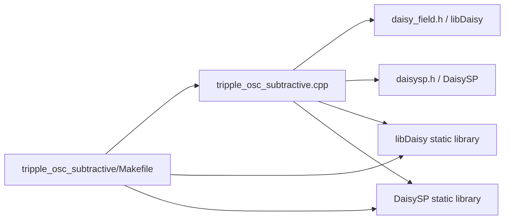
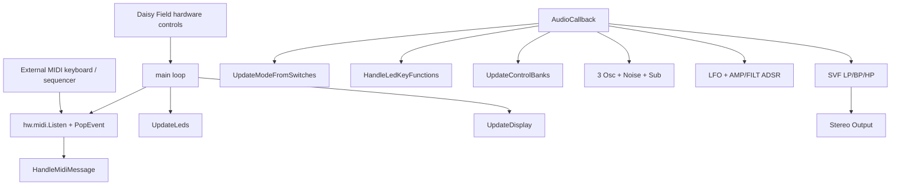
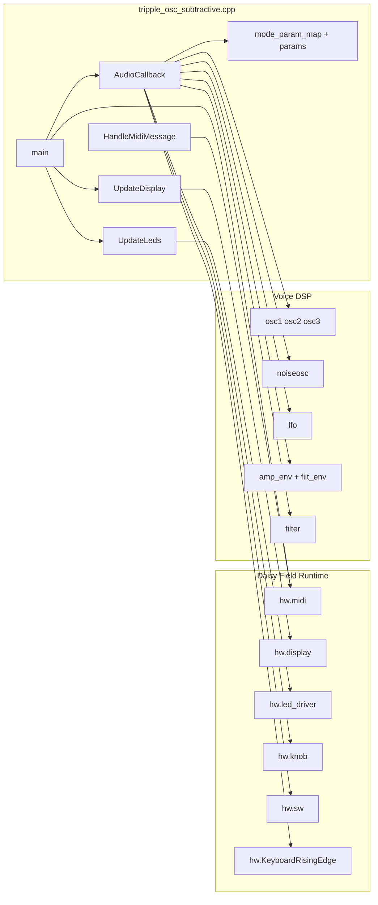
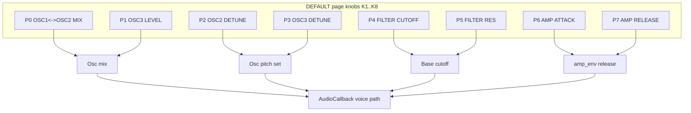
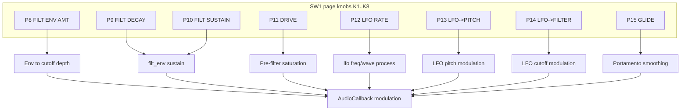
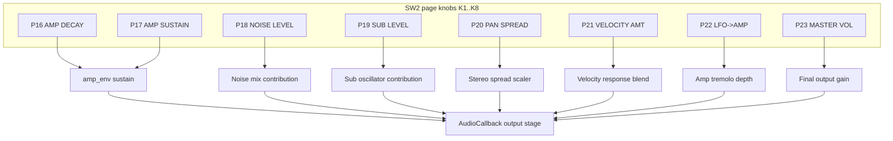

# tripple_osc_subtractive Dependencies

This document tracks the dependency structure for the current `tripple_osc_subtractive` Daisy Field project.

## Project status (Codex Cloud -> Local)

- **Current working status:** Local project folder is present and self-contained in:
  - `DaisyExamples/MyProjects/_projects/tripple_osc_subtractive`
- **Code source status:** Main runtime source is local in `tripple_osc_subtractive.cpp`.
- **Docs status:** `README.md`, `CONTROLS.md`, and this `Dependencies.md` are local and synchronized for this project.
- **Build environment status in this container:** compile is blocked unless repository-relative `libDaisy` and `DaisySP` dependencies are present.

## 1) Build and link dependency graph



## 2) Runtime control and audio flow



## 3) File-level application dependency graph



## 4) Control-bank and parameter-flow diagrams

### 4.1 Can this be one Mermaid graph?

Short answer: **partially**.

- A single graph can show the overall relationship between the 3 pages, shared DSP destinations, and UI feedback loops.
- But a single graph that also lists all 24 parameters and all destinations becomes visually dense and hard to maintain.

For this project, the best documentation compromise is:

1. **One compact global graph** for architecture-level understanding.
2. **Three per-page detail graphs** (DEFAULT/SW1/SW2) for complete parameter coverage.

### 4.2 Single global controls-flow graph (overview)

```mermaid
flowchart LR
    SW[SW1/SW2 page select] --> MODE[current_mode]
    K[K1-K8 knobs] --> MAP[mode_param_map 3x8]
    MODE --> MAP
    MAP --> P[params[24] store]

    subgraph PAGES[Control Pages]
        D[DEFAULT page
P0..P7]
        S1[SW1 page
P8..P15]
        S2[SW2 page
P16..P23]
    end

    P --> D
    P --> S1
    P --> S2

    D --> OSC[Oscillator Pitch/Mix Bus]
    D --> FILT[Filter Base Bus]
    D --> AMPENV[Amp Env Time Bus]

    S1 --> FILTENV[Filter Env Bus]
    S1 --> LFOBUS[LFO Routing Bus]
    S1 --> PERF[Performance Bus]

    S2 --> AMPBUS[Amp Shape Bus]
    S2 --> NOISEBUS[Noise/Sub/Stereo Bus]
    S2 --> GAIN[Output Gain Bus]

    OSC --> AUDIO[AudioCallback DSP]
    FILT --> AUDIO
    AMPENV --> AUDIO
    FILTENV --> AUDIO
    LFOBUS --> AUDIO
    PERF --> AUDIO
    AMPBUS --> AUDIO
    NOISEBUS --> AUDIO
    GAIN --> AUDIO

    AUDIO --> OUT[Stereo Out]

    P --> OLED[UpdateDisplay + zoom]
    P --> LEDS[UpdateLeds rings]
    MODE --> OLED
    MODE --> LEDS
```

### 4.3 Split detailed graphs (complete parameter coverage)

#### 4.3.1 DEFAULT page (`P0..P7`) detailed flow



#### 4.3.2 SW1 page (`P8..P15`) detailed flow



#### 4.3.3 SW2 page (`P16..P23`) detailed flow



### 4.4 Interconnection notes across pages

- The pages are **stored independently** in one `params[24]` array but consumed together every audio block.
- SW1 modulation parameters (LFO/filter env/drive/glide) alter how DEFAULT oscillator+filter settings behave.
- SW2 amplitude/output parameters shape final loudness, stereo image, and dynamics after DEFAULT+SW1 synthesis stages.

## 5) MIDI state and note-priority graph

```mermaid
flowchart TD
    EVT[MidiEvent]
    NOTEON[NoteOn]
    NOTEOFF[NoteOff]

    HELD[note_held[128]]
    RECOMP[RecomputeCurrentNote]

    NOTE[current_note]
    VEL[current_velocity]
    GATE[gate]

    EVT --> NOTEON
    EVT --> NOTEOFF

    NOTEON --> HELD
    NOTEON --> VEL
    NOTEON --> NOTE
    NOTEON --> GATE

    NOTEOFF --> HELD
    HELD --> RECOMP
    RECOMP --> NOTE
    RECOMP --> GATE
```

## 6) Makefile dependency notes

- `TARGET = tripple_osc_subtractive`
- `CPP_SOURCES = tripple_osc_subtractive.cpp`
- External dirs are expected at:
  - `../../../libDaisy`
  - `../../../DaisySP`

If these paths are missing in the local checkout, `make` will fail before compilation.

## 7) Documentation synchronization policy

When control routing, mode mapping, or DSP architecture changes, update all of:

1. `README.md`
2. `CONTROLS.md`
3. `Dependencies.md`

in the same commit to keep local docs consistent.
