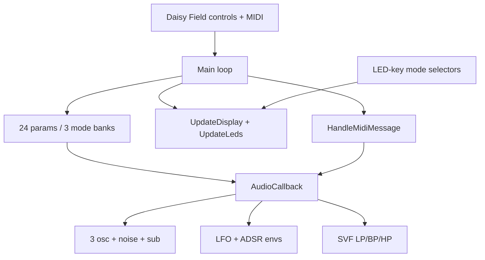

# tripple_osc_subtractive Dependencies

This document tracks build/runtime dependencies for the Daisy Field `tripple_osc_subtractive` project.

## 1) Build dependencies

- `libDaisy` from `../../../libDaisy`
- `DaisySP` from `../../../DaisySP`
- Project-local source:
  - `tripple_osc_subtractive.cpp`

Makefile entry points:

- `TARGET = tripple_osc_subtractive`
- `CPP_SOURCES = tripple_osc_subtractive.cpp`
- Include core build system from `$(LIBDAISY_DIR)/core/Makefile`

## 2) Runtime hardware dependencies

- **Daisy Field**
  - 8 knobs
  - SW1 + SW2 switches
  - Key matrix / key LEDs (`A1-A8`, `B1-B8`)
  - OLED display
  - Stereo audio out
  - MIDI input transport exposed as `hw.midi`

## 3) Software component graph

## 4) Control architecture dependency

- `mode_param_map` binds 8 physical knobs to 24 logical parameters by mode.
- `UpdateModeFromSwitches()` controls active page.
- `HandleLedKeyFunctions()` applies mode-specific key actions.
- `UpdateControlBanks()` writes active bank values and triggers OLED zoom context.

## 5) MIDI dependency notes

- Voice pitch/gate state depends on incoming MIDI events.
- Held-note table drives note-priority selection.
- Channel filtering depends on SW1-mode key selections.

## 6) Documentation sync policy

When changing control assignments or LED-key behavior, update:

1. `README.md`
2. `CONTROLS.md`
3. `Dependencies.md`

in the same commit.
