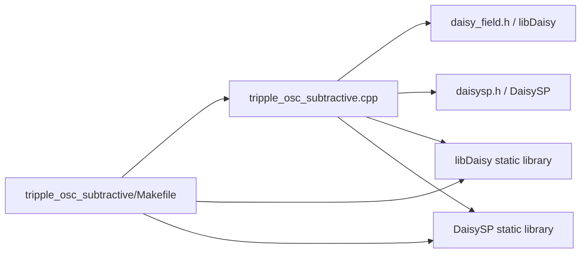
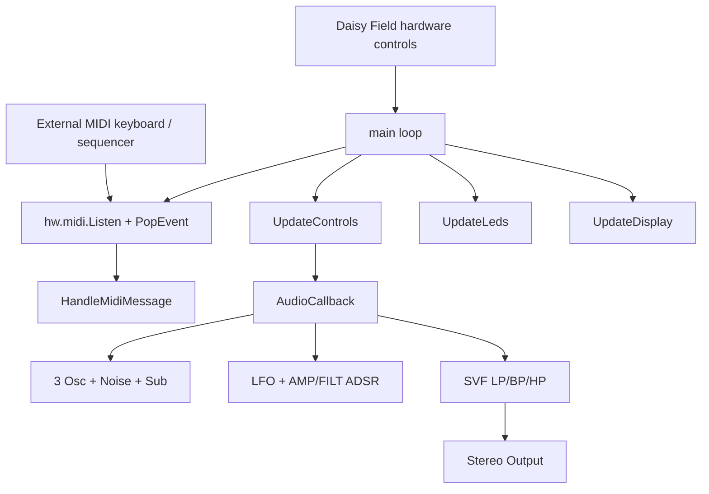
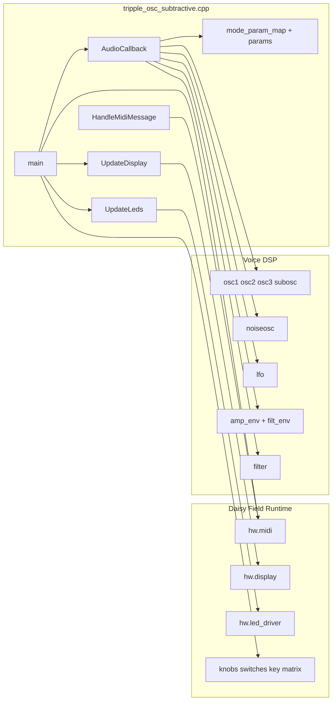
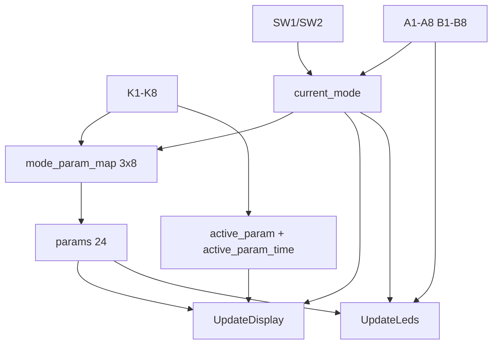

# tripple_osc_subtractive Dependencies

This document tracks the dependency structure for the current `tripple_osc_subtractive` Daisy Field project.

## Project status (Codex Cloud -> Local)

- **Current working status:** Local project folder is present and self-contained in:
  - `DaisyExamples/MyProjects/_projects/tripple_osc_subtractive`
- **Code source status:** Main runtime source is local in `tripple_osc_subtractive.cpp`.
- **Docs status:** `README.md`, `CONTROLS.md`, and this `Dependencies.md` are local and synchronized for this project.
- **Build environment status:** compile depends on repository-relative `libDaisy` and `DaisySP` directories being present.

## 1) Build and link dependency graph



## 2) Runtime control and audio flow



## 3) File-level application dependency graph



## 4) Control-bank and UI dependency graph



## 5) MIDI state and note-priority graph

```mermaid
flowchart TD
    EVT[MidiEvent]
    NOTEON[NoteOn]
    NOTEOFF[NoteOff]

    HELD[note_held[128]]
    RECOMP[RecomputeCurrentNote]

    NOTE[current_note]
    VEL[current_velocity]
    GATE[gate]

    EVT --> NOTEON
    EVT --> NOTEOFF

    NOTEON --> HELD
    NOTEON --> VEL
    NOTEON --> NOTE
    NOTEON --> GATE

    NOTEOFF --> HELD
    HELD --> RECOMP
    RECOMP --> NOTE
    RECOMP --> GATE
```

## 6) Makefile dependency notes

- `TARGET = tripple_osc_subtractive`
- `CPP_SOURCES = tripple_osc_subtractive.cpp`
- External dirs are expected at:
  - `../../../libDaisy`
  - `../../../DaisySP`

If these paths are missing in the local checkout, `make` will fail before compilation.

## 7) Documentation synchronization policy

When control routing, mode mapping, or DSP architecture changes, update all of:

1. `README.md`
2. `CONTROLS.md`
3. `Dependencies.md`

in the same commit to keep local docs consistent.
