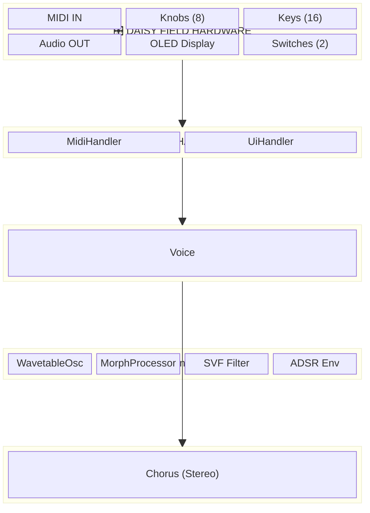
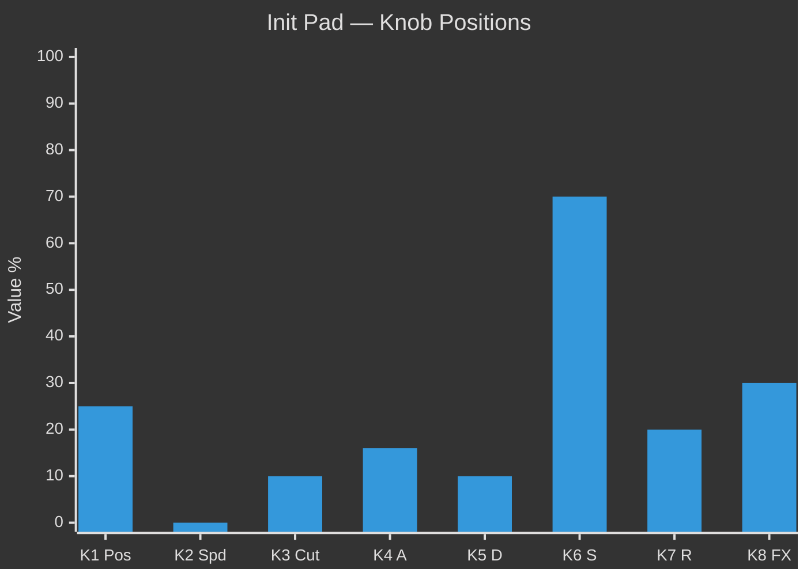
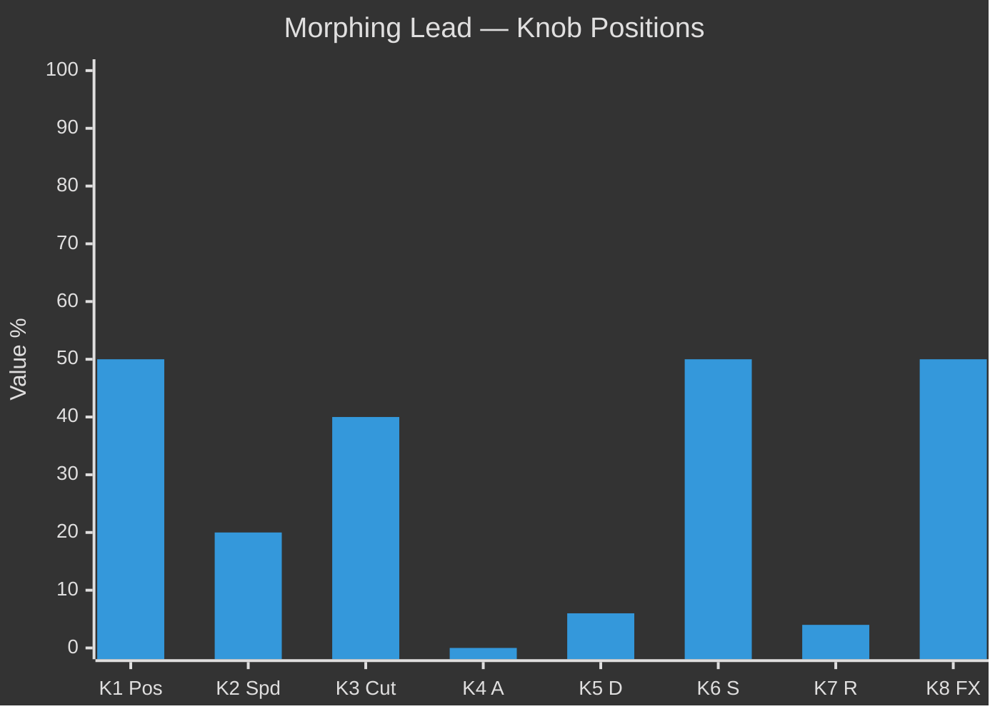
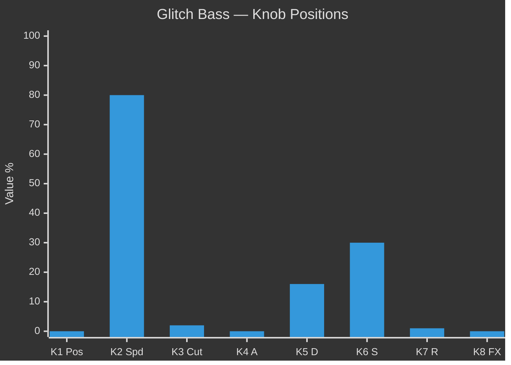
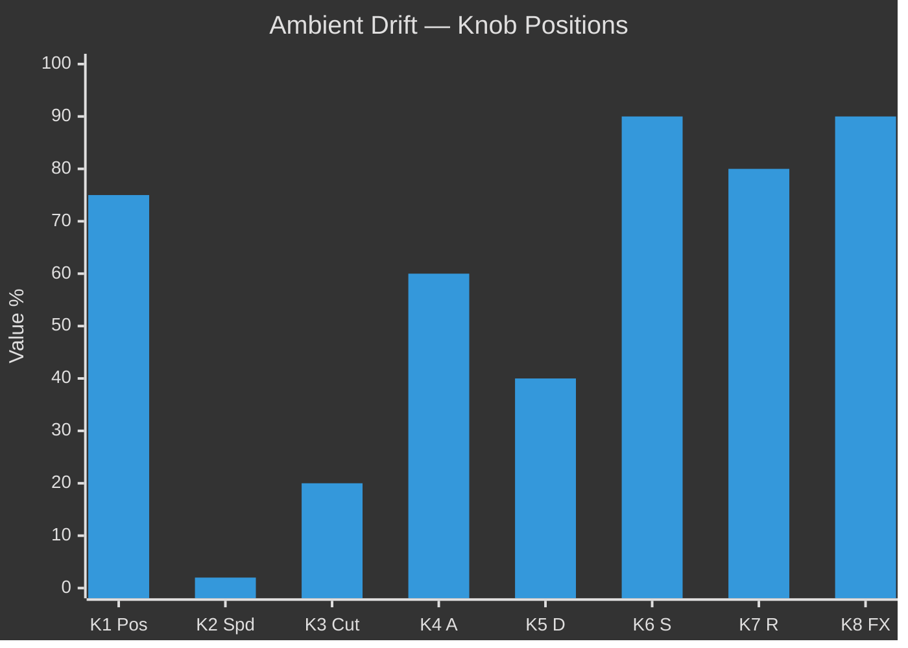

# Field Wavetable Morph Synth — Controls Documentation

## 1. Control Mapping

### Hardware Overview

| Control Type | Quantity | Purpose |
|--------------|----------|---------|
| **Knobs** | 8 | Continuous parameter control |
| **Keys (A-row)** | 8 | Wavetable bank selection |
| **Keys (B-row)** | 8 | Morph curve selection |
| **Switches** | 2 | Toggle states (LFO, FX Bypass) |

---

### Knob Assignments

| Knob | Parameter | Range | Default | Unit |
|------|-----------|-------|---------|------|
| **K1** | Wavetable Position | 0.0 – 1.0 | 0.0 | — |
| **K2** | Morph Speed | 0.0 – 10.0 | 1.0 | Hz |
| **K3** | Filter Cutoff | 20 – 20,000 | 1000 | Hz |
| **K4** | Attack | 0.0 – 5.0 | 0.1 | s |
| **K5** | Decay | 0.0 – 5.0 | 0.1 | s |
| **K6** | Sustain | 0.0 – 1.0 | 0.8 | — |
| **K7** | Release | 0.0 – 10.0 | 0.2 | s |
| **K8** | Output Volume | 0.0 – 1.0 | 0.5 | — |

---

### Key Assignments

#### A-Row: Wavetable Bank Select (A1–A8)

| Key | Bank | Description |
|-----|------|-------------|
| A1 | `BANK_SINE` | Pure sine harmonics |
| A2 | `BANK_SAW` | Sawtooth-based tables |
| A3 | `BANK_SQUARE` | Square/pulse tables |
| A4 | `BANK_TRIANGLE` | Triangle wave variants |
| A5 | `BANK_CUSTOM1` | User wavetable 1 |
| A6 | `BANK_CUSTOM2` | User wavetable 2 |
| A7 | `BANK_CUSTOM3` | User wavetable 3 |
| A8 | `BANK_CUSTOM4` | User wavetable 4 |

#### B-Row: Morph Curve Select (B1–B8)

| Key | Curve | Behavior |
|-----|-------|----------|
| B1 | `LINEAR` | Even transition (0→1) |
| B2 | `EXPONENTIAL` | Slow start, fast end |
| B3 | `LOGARITHMIC` | Fast start, slow end |
| B4 | `SINE` | Smooth S-curve |
| B5 | `TRIANGLE` | Linear ping-pong |
| B6 | `STEP` | Quantized jumps |
| B7 | `RANDOM` | Randomized steps |
| B8 | `CUSTOM` | User-defined curve |

---

### Switch Assignments

| Switch | Function | States |
|--------|----------|--------|
| **SW1** | LFO Enable | OFF / ON (toggles position LFO) |
| **SW2** | FX Bypass | OFF / ON (bypasses Chorus FX) |

---

## 2. System Diagrams

### Diagram Type Analysis

| Diagram | Best Visualization | Rationale |
|---------|-------------------|-----------|
| **A. System Architecture** | **Block Diagram** | Shows component hierarchy and relationships; emphasizes modularity over flow |
| **B. Audio Signal Flow** | **Signal Flow Graph** | Shows directional audio path with processing stages; standard DSP notation |
| **C. Control Flow** | **Flowchart** | Shows decision logic and event-driven control updates; emphasizes branching |

---

### A. System Architecture — Block Diagram

**Why Block Diagram?** Architecture diagrams emphasize containment and module boundaries. Block diagrams show "what contains what" better than flowcharts.



---

### B. Audio Signal Flow — Signal Flow Graph

**Why Signal Flow Graph?** DSP systems use directed graphs to show sample-by-sample processing order. Nodes are processors, edges are audio connections.

```mermaid
flowchart LR
    subgraph OSC["🎵 Oscillator"]
        WT["Wavetable<br/>Bank"]
        POS["Position<br/>(K1)"]
        MORPH["Morph<br/>Processor"]
    end
    
    subgraph FILT["🎚️ Filter"]
        SVF["SVF<br/>Lowpass"]
        CUT["Cutoff<br/>(K3)"]
    end
    
    subgraph ENV["📈 Envelope"]
        ADSR["ADSR<br/>Generator"]
        A["A (K4)"]
        D["D (K5)"]
        S["S (K6)"]
        R["R (K7)"]
    end
    
    subgraph FX["✨ Effects"]
        CH["Chorus"]
        MIX["Dry/Wet<br/>(K8)"]
    end
    
    subgraph OUT["🔊 Output"]
        L["Left"]
        R2["Right"]
    end
    
    WT --> MORPH
    POS --> MORPH
    MORPH -->|"sample"| SVF
    CUT --> SVF
    SVF -->|"filtered"| VCA["VCA"]
    ADSR --> VCA
    A & D & S & R --> ADSR
    VCA -->|"shaped"| CH
    MIX --> CH
    CH --> L & R2
    
    style OSC fill:#2d5016,stroke:#4a8c28
    style FILT fill:#1a4a6e,stroke:#2d7ab8
    style ENV fill:#5c3d1e,stroke:#8c5a2d
    style FX fill:#4a1a4a,stroke:#7a2d7a
    style OUT fill:#333,stroke:#666
```



---

### C. Controls — Flowchart

**Why Flowchart?** Control handling involves conditional logic (key detection, switch toggling). Flowcharts show decision branches and state changes clearly.

```mermaid
flowchart TD
    START([Main Loop<br/>100Hz]) --> PROC[ProcessAllControls]
    
    PROC --> KNOBS{Process<br/>Knobs?}
    KNOBS -->|Yes| K1[Read K1-K8]
    K1 --> SMOOTH[Apply Smoothing]
    SMOOTH --> KEYS
    KNOBS -->|No| KEYS
    
    KEYS{Key<br/>Pressed?}
    KEYS -->|A1-A8| BANK[Set Wavetable Bank]
    KEYS -->|B1-B8| CURVE[Set Morph Curve]
    KEYS -->|None| SW
    BANK --> SW
    CURVE --> SW
    
    SW{Switch<br/>Changed?}
    SW -->|SW1| LFO[Toggle LFO Enable]
    SW -->|SW2| FXB[Toggle FX Bypass]
    SW -->|None| UPDATE
    LFO --> UPDATE
    FXB --> UPDATE
    
    UPDATE[Update Voice Parameters]
    UPDATE --> MIDI{MIDI<br/>Message?}
    MIDI -->|NoteOn| NOTE_ON[voice.NoteOn]
    MIDI -->|NoteOff| NOTE_OFF[voice.NoteOff]
    MIDI -->|CC| CC[Apply CC Mapping]
    MIDI -->|None| DISPLAY
    NOTE_ON --> DISPLAY
    NOTE_OFF --> DISPLAY
    CC --> DISPLAY
    
    DISPLAY[Update OLED Display]
    DISPLAY --> WAIT[Delay 10ms]
    WAIT --> START
    
    style START fill:#1a5c1a,stroke:#2d8c2d
    style UPDATE fill:#1a4a6e,stroke:#2d7ab8
    style DISPLAY fill:#5c3d1e,stroke:#8c5a2d
```



---

## 3. Presets

### Preset 1: "Init Pad"

**Character:** Warm, sustained pad with gentle filter

| Control | Value | Notes |
|---------|-------|-------|
| Bank | A1 (Sine) | Pure harmonics |
| Curve | B1 (Linear) | Even morphing |
| K1 Position | 0.25 | Slight harmonic content |
| K2 Speed | 0.0 | No LFO modulation |
| K3 Cutoff | 2000 Hz | Mellow filter |
| K4 Attack | 0.8 s | Slow fade in |
| K5 Decay | 0.5 s | Medium decay |
| K6 Sustain | 0.7 | High sustain |
| K7 Release | 2.0 s | Long tail |
| K8 FX | 0.3 | Light chorus |
| SW1 LFO | OFF | Static position |
| SW2 FX | ON | FX active |



---

### Preset 2: "Morphing Lead"

**Character:** Evolving lead with LFO-modulated wavetable scanning

| Control | Value | Notes |
|---------|-------|-------|
| Bank | A2 (Saw) | Bright harmonics |
| Curve | B4 (Sine) | Smooth S-curve morph |
| K1 Position | 0.5 | Center of bank |
| K2 Speed | 2.0 Hz | Moderate LFO rate |
| K3 Cutoff | 8000 Hz | Bright filter |
| K4 Attack | 0.01 s | Instant attack |
| K5 Decay | 0.3 s | Quick decay |
| K6 Sustain | 0.5 | Medium sustain |
| K7 Release | 0.4 s | Short release |
| K8 FX | 0.5 | Medium chorus |
| SW1 LFO | **ON** | Active morphing |
| SW2 FX | ON | FX active |



---

### Preset 3: "Glitch Bass"

**Character:** Aggressive bass with stepped random morphing

| Control | Value | Notes |
|---------|-------|-------|
| Bank | A3 (Square) | Hollow, punchy |
| Curve | B7 (Random) | Chaotic steps |
| K1 Position | 0.0 | Base waveform |
| K2 Speed | 8.0 Hz | Fast random jumps |
| K3 Cutoff | 500 Hz | Dark, subby |
| K4 Attack | 0.0 s | Instant |
| K5 Decay | 0.8 s | Longer decay |
| K6 Sustain | 0.3 | Low sustain |
| K7 Release | 0.1 s | Tight release |
| K8 FX | 0.0 | No chorus (dry) |
| SW1 LFO | **ON** | Random modulation |
| SW2 FX | OFF | FX bypassed |



---

### Preset 4: "Ambient Drift"

**Character:** Slow, evolving texture with deep reverb-like chorus

| Control | Value | Notes |
|---------|-------|-------|
| Bank | A5 (Custom1) | User wavetable |
| Curve | B3 (Logarithmic) | Fast onset, slow tail |
| K1 Position | 0.75 | Upper harmonics |
| K2 Speed | 0.2 Hz | Very slow drift |
| K3 Cutoff | 4000 Hz | Balanced brightness |
| K4 Attack | 3.0 s | Very slow swell |
| K5 Decay | 2.0 s | Extended decay |
| K6 Sustain | 0.9 | Near-full sustain |
| K7 Release | 8.0 s | Long fade |
| K8 FX | 0.9 | Heavy chorus/shimmer |
| SW1 LFO | **ON** | Gentle drift |
| SW2 FX | ON | FX active |



---

### Preset 5: "8-Bit Escalator"

**Character:** Stepped, lo-fi video game texture.

| Control | Value | Notes |
|---------|-------|-------|
| Bank | **A3 (Square)** | Pulse characters |
| Curve | **B6 (Step)** | Digital quantization |
| K1 Position | 0.0 | Start wide |
| K2 Speed | 4.0 Hz | Fast stepping |
| K3 Cutoff | 12000 Hz | Open bright |
| K4 Attack | 0.0 s | Insta-hit |
| K5 Decay | 0.2 s | Short plip |
| K6 Sustain | 0.4 | Low sustain |
| K7 Release | 0.2 s | Short tail |
| K8 FX | 0.0 | Dry |
| SW1 LFO | **ON** | Auto-stepping |

**🎹 Interaction Guide:**
*   **Key A (Bank)**:
    *   Switch to **A1 (Sine)** for "Bubble Bobble" style round blips.
    *   Switch to **A2 (Saw)** for aggressive "NES Action" lead sounds.
*   **Key B (Curve)**:
    *   **B6 (Step)** is critical here! It forces the morph to jump between wavetable frames rather than sliding.
    *   Switching to **B1 (Linear)** ruins the effect, turning the cool digital stepping into a generic pulse width modulation slide. Keep it on B6!

---

### Preset 6: "Cyber Flute"

**Character:** Breathy, hollow wind instrument with robotic overtones.

| Control | Value | Notes |
|---------|-------|-------|
| Bank | **A4 (Triangle)** | Hollow base |
| Curve | **B4 (Sine)** | Smooth swelling |
| K1 Position | 0.3 | Harmonic Start |
| K2 Speed | 3.0 Hz | Vibrato-speed morph |
| K3 Cutoff | 2500 Hz | Medium damping |
| K4 Attack | 0.2 s | Soft blow |
| K5 Decay | 0.0 s | N/A |
| K6 Sustain | 1.0 | Full breath |
| K7 Release | 0.4 s | Release gas |
| K8 FX | 0.6 | Airy Chorus |
| SW1 LFO | **ON** | Morphing timbre |

**🎹 Interaction Guide:**
*   **Key A (Bank)**:
    *   Current **A4 (Triangle)** provides the distinct hollow flute sound.
    *   Switch to **A2 (Saw)** to instantly transform into a "Vangelis Brass" pad.
*   **Key B (Curve)**:
    *   Current **B4 (Sine)** makes the timbre undulate smoothly like natural vibrato.
    *   Switch to **B7 (Random)** to simulate a "broken circuitry" flute that glitches randomly while sustaining.

---

### Preset 7: "Industrial Drone"

**Character:** Harsh, grinding texture for cinematic tension.

| Control | Value | Notes |
|---------|-------|-------|
| Bank | **A2 (Saw)** | Rich harmonics |
| Curve | **B2 (Exponential)** | Sharp transitions |
| K1 Position | 0.8 | High harmonic start |
| K2 Speed | 0.5 Hz | Slow grind |
| K3 Cutoff | 800 Hz | Low rumble |
| K4 Attack | 4.0 s | Slow rise |
| K5 Decay | 0.0 s | N/A |
| K6 Sustain | 1.0 | Infinite drone |
| K7 Release | 5.0 s | Fade out |
| K8 FX | 0.8 | Metallic space |
| SW1 LFO | **ON** | Evolving texture |

**🎹 Interaction Guide:**
*   **Key A (Bank)**:
    *   **A2 (Saw)** gives the grinding metal teeth.
    *   Switch to **A3 (Square)** for a hollower, "ventilation shaft" drone.
*   **Key B (Curve)**:
    *   **B2 (Exponential)** keeps the sound hanging on certain harmonics before snapping to the next.
    *   Switch to **B6 (Step)** to turn the smooth grind into a rhythmic "machine press" repeating pattern.

---

### Preset 8: "Chaos Engine"

**Character:** Unpredictable computer noise, great for SFX.

| Control | Value | Notes |
|---------|-------|-------|
| Bank | **A3 (Square)** | Binary data sound |
| Curve | **B7 (Random)** | Pure chaos |
| K1 Position | 0.0 | Irrelevant (LFO driven) |
| K2 Speed | 10.0 Hz | Max speed chaos |
| K3 Cutoff | 15000 Hz | Unfiltered data |
| K4 Attack | 0.0 s | Instant |
| K5 Decay | 0.1 s | Percussive |
| K6 Sustain | 0.8 | High noise floor |
| K7 Release | 0.1 s | Quick stop |
| K8 FX | 0.2 | Slight blur |
| SW1 LFO | **ON** | Required for chaos |

**🎹 Interaction Guide:**
*   **Key A (Bank)**:
    *   **A3 (Square)** sounds like a dial-up modem.
    *   Switch to **A1 (Sine)** to get "R2-D2" style bleeps and bloops.
*   **Key B (Curve)**:
    *   **B7 (Random)** is the engine here. It grabs a random wavetable frame at every LFO cycle.
    *   Switch to **B4 (Sine)** to tame the chaos into a fast, alarming siren.

---

## Quick Reference Card

```
┌─────────────────────────────────────────────────────────┐
│  FIELD WAVETABLE MORPH SYNTH — CONTROL QUICK REFERENCE  │
├─────────────────────────────────────────────────────────┤
│  KNOBS                                                  │
│  K1: Position    K2: Speed     K3: Cutoff   K4: Attack  │
│  K5: Decay       K6: Sustain   K7: Release  K8: Volume  │
├─────────────────────────────────────────────────────────┤
│  KEYS (A-ROW): Bank Select                              │
│  A1=Sin A2=Saw A3=Sqr A4=Tri A5-A8=Custom               │
├─────────────────────────────────────────────────────────┤
│  KEYS (B-ROW): Morph Curve                              │
│  B1=Lin B2=Exp B3=Log B4=Sin B5=Tri B6=Stp B7=Rnd B8=Cus│
├─────────────────────────────────────────────────────────┤
│  SWITCHES                                               │
│  SW1: LFO On/Off    SW2: FX Bypass                      │
└─────────────────────────────────────────────────────────┘
```
