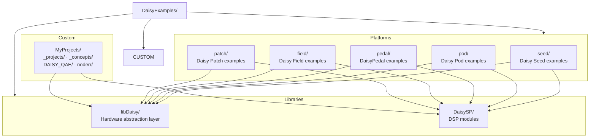
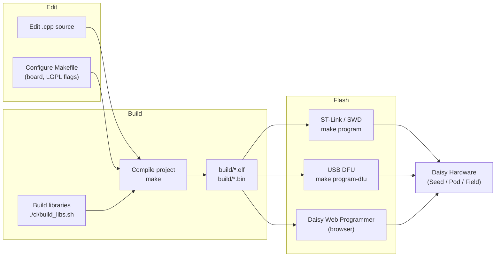
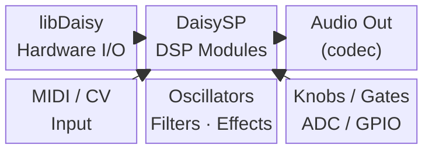
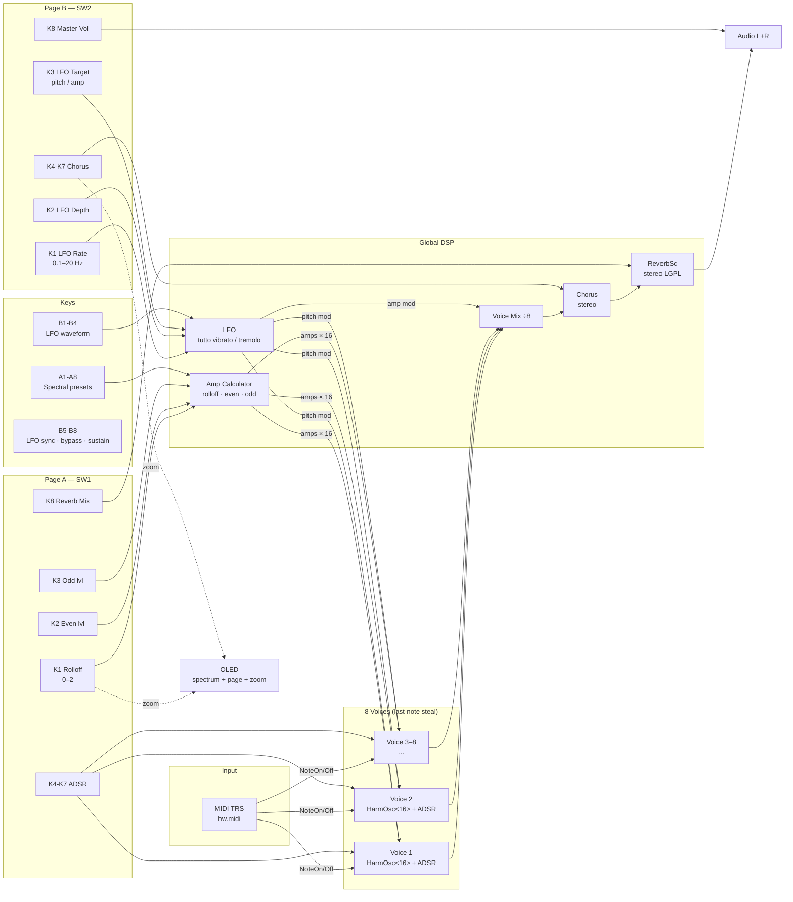

<h1 align="center">Daisy Examples</h1>


<!--CI Badges-->
<p align="center">
    <a href="https://github.com/electro-smith/libDaisy/actions/workflows/build.yml">
      
    </a>
    <a href="https://github.com/electro-smith/libDaisy/actions/workflows/style.yml">
      
    </a>
    <a href="https://daisy.audio/software/">
      
    </a>
</p>

<!-- Non-CI Badges -->
<p align="center">
    <a href="https://opensource.org/licenses/MIT">
      
    </a>
    <a href="https://discord.gg/ByHBnMtQTR">
        
    </a>
    <a href="https://forum.electro-smith.com/">
        
    </a>
</p>

If you are just getting started with Daisy, check out our [Getting Started page](https://daisy.audio/tutorials/cpp-dev-env/)!

This repo is home to a functional pipeline utilizing libDaisy and DaisySP libraries.

Examples are broken down by hardware platform.

Included as well are:

- Both libraries as git submodules
- Scripts for rebuildling the libraries as well as all examples.
- cube/ folder with .ioc files and example projects that use STM32CubeMX generated code via the STM32 HAL.
- `MyProjects/` — custom user projects for Daisy Field, Pod, and Seed.

---

## Repository Structure



---

## Build & Flash Workflow



---

## DSP Architecture (libDaisy + DaisySP)



## Getting Started

### Getting the Source

First off, there are a few ways to clone and initialize the repo (with its submodules).

You can do either of the following:

```sh
git clone --recursive https://github.com/electro-smith/DaisyExamples
```

or

```sh
git clone https://github.com/electro-smith/DaisyExamples
git submodule update --init
```

### Compiling the Source

Once you have the repository and the submodules (libDaisy/DaisySP) properly cloned, and the toolchain installed (for details see the [Daisy support site](https://daisy.audio/tutorials/Understanding-the-Toolchain/) for platform specific instructions) it's time to build the libraries, and some examples.

To build everything at once, run: `./rebuild_all.sh`

This is a little time  consuming, and more often than not, only one example, or the libraries need to get built frequently.

To build both libraries at once simply run:

`./ci/build_libs.sh`

This is the same as going to each library's directory and running `make`.

This may take a few minutes depending on your computer's hardware. But should have the following output when finished:

```sh
$ ./ci/build_libs.sh 
building libDaisy . . .
rm -fR build
arm-none-eabi-ar: creating build/libdaisy.a
done.
building DaisySP . . .
rm -fR build
done.
```

Similarly, all of the examples can be bulit by running:

`./ci/build_examples.py`

However, this may also take a few minutes. An individual example can be compiled by navigating to that directory, and running Make. For example to build the Blink example:

```sh
cd seed/Blink
$ make 
arm-none-eabi-g++  -c -mcpu=cortex-m7 -mthumb -mfpu=fpv5-d16 -mfloat-abi=hard  -DUSE_HAL_DRIVER -DSTM32H750xx -DUSE_HAL_DRIVER -DHSE_VALUE=16000000 -DSTM32H750xx  -I../../libdaisy -I../../libdaisy/src/ -I../../libdaisy/src/usbd -I../../libdaisy/Drivers/CMSIS/Include/ -I../../libdaisy/Drivers/CMSIS/Device/ST/STM32H7xx/Include -I../../libdaisy/Drivers/STM32H7xx_HAL_Driver/Inc/ -I../../libdaisy/Middlewares/ST/STM32_USB_Device_Library/Core/Inc -I../../libdaisy/core/ -I../../DaisySP  -O2 -Wall -Wno-missing-attributes -fasm -fdata-sections -ffunction-sections -MMD -MP -MF"build/Blink.d" 
-fno-exceptions -fasm -finline -finline-functions-called-once -fshort-enums -fno-move-loop-invariants -fno-unwind-tables  -std=gnu++14 -Wa,-a,-ad,-alms=build/Blink.lst Blink.cpp -o build/Blink.o
arm-none-eabi-g++  build/system_stm32h7xx.o build/startup_stm32h750xx.o build/Blink.o   -mcpu=cortex-m7 -mthumb -mfpu=fpv5-d16 -mfloat-abi=hard --specs=nano.specs --specs=nosys.specs -T../../libdaisy/core/STM32H750IB_flash.lds -L../../libdaisy/build  -L ../../DaisySP/build -ldaisy -lc -lm -lnosys -ldaisysp -Wl,-Map=build/Blink.map,--cref -Wl,--gc-sections -o build/Blink.elf
arm-none-eabi-size build/Blink.elf
   text    data     bss     dec     hex filename
  23468     704   19072   43244    a8ec build/Blink.elf
arm-none-eabi-objcopy -O ihex build/Blink.elf build/Blink.hex
arm-none-eabi-objcopy -O binary -S build/Blink.elf build/Blink.bin
```

### Flashing an example to the Daisy

The example can be programmed via the [Daisy Web Programmer](https://electro-smith.github.io/Programmer/)
Or the example can the be programmed on the commandline:

```sh
# using USB (after entering bootloader mode)
make program-dfu
# using JTAG/SWD adaptor (like STLink)
make program
```

## Updating the submodules

To pull everything for the repo and submodules:

```sh
git pull --recurse-submodules
```

to only pull changes for the submodules:

```sh
git submodule update --remote
```

Alternatively, you can simply run git commands from within the submodule and they will be treated as if you were in that repository instead of Daisy_Examples

Whenenever there are changes to the libraries (whether from pulling from git or manually editing the libraries) they will need to be rebuilt. This can be done by either running `./ci/build_libs.sh` or entering the directory of the library with changes and running `make`.

## Adding New Examples and Updating Old Ones

`helper.py` is a python script in the root directory that can be used for several helpful utilities.

The script does expect that python3 is installed.

One thing that must be kept in mind is that the script does not know where libDaisy/DaisySP
are located. So all copied/created projects are expected to be two directories up from whereever the libraries are  (e.g. `seed/new_project/`).

Adding an argument to specify this is planned, but not yet available.

### Create new example project

Creates a brand new example project containing a Makefile, compilable source file,
and debug resources for VisualStudio using VisualGDB, and for VS Code using Cortex Debug.

The board option can be any of the following:

field, patch, petal, pod, seed, versio

`./helper.py create pod/MyNewProject --board pod`

### Duplicate existing example project

Copies an existing project in its entireity. It does ignore `build/` and `VisualGDB/` since these would have been compiled for the previous project.

This updates the necessary paths inside of debug related files that may exist by searching for the base name of the old project, and replacing it with the new base name.

This does copy resource files like `.ai` and `.png` files, but does not try to process them.

`./helper.py copy pod/MyNewProject --source patch/SomeOlderProject`

### Update existing project with Debug resources

Updates an existing project with functional debugging resources for VisualStudio and the VisualGDB extension and for VS Code and the Cortex Debug extension.

<b>This also removes any existing files in their place. For trivial projects this will make little difference, but useful modifications to existing files will be lost. So back up previous project, or don't update. </b>

`./helper.py update pod/MyNewProject`

running this operation with no destination argument will update all examples.

Examples are searched for in the directories named after each supported platform.

## Testing Changes to the libraries

More documentation coming soon, but a common scenario would be one where users are making changes to their forks of a library.

As the libraries' submodules are tracked to origin-master by default, there are a few ways to go about this.

1. You can checkout a branch from within the repo as normal, and test and work on the library as you would.
2. Each example has conditional setters in their Makefile for variables: `DAISYSP_DIR` and `LIBDAISY_DIR`. These can be set externally to a destination of the users choice.

There are some known issues when using Windows here.

Our test environment for the Make builds using MINGW64 (via Git Bash).

For the variables to work correctly in that environment you would have to set these paths to absolute paths using Windows syntax (i.e. `C:\Users\name\path\to\libdaisy`). Make internally converts this to a linux style path.

## Testing build and style checks locally

To test building both libraries, and all non-experimental examples run:

`./rebuild_all.sh`

To test generating the dist folder (containing distributable binaries of all non-experimental examples):

**Note: this does require python 3 to run**

`./ci/build_dist.py`

To check style before the automated style fixing happens, run:

`./ci/local_style_check.sh`

**Note: this requires clang-format to be installed, and accessible from `$PATH`. Automated style checking and fixing is done with clang-format-10**

---

## MyProjects

`MyProjects/_projects/` contains custom patches built on top of libDaisy + DaisySP.

### Field_AdditiveSynth — 8-voice polyphonic additive synthesizer

8 voices, each running `HarmonicOscillator<16>` + `Adsr`. Global LFO, Chorus, and ReverbSc.
Dual knob pages (SW1/SW2) with pickup/catch. A1-A8 spectral presets, B1-B8 LFO/performance.

**Signal flow:**



**Build:**

```sh
cd MyProjects/_projects/Field_AdditiveSynth
make
make program
```
