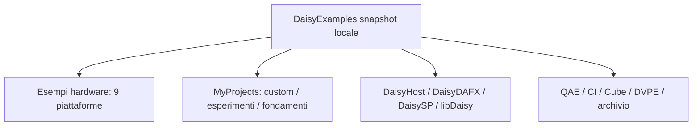

# Repository scope

```mermaid
flowchart TB
  R[DaisyExamples snapshot locale] --> B[Esempi hardware: 9 piattaforme]
  R --> C[MyProjects: custom / esperimenti / fondamenti]
  R --> L[DaisyHost / DaisyDAFX / DaisySP / libDaisy]
  R --> T[QAE / CI / Cube / DVPE / archivio]
```

Source: coverage.json → roots. Boundary: filesystem hierarchy, no runtime topology.
