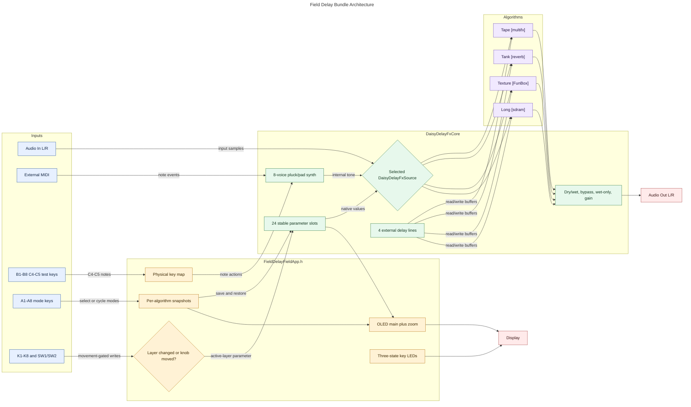
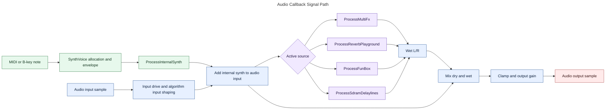
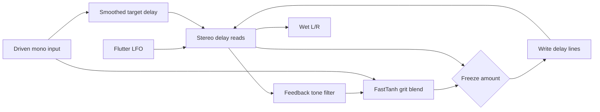
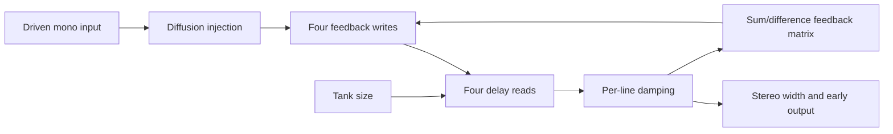
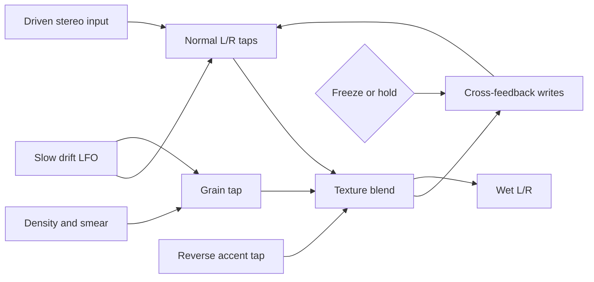
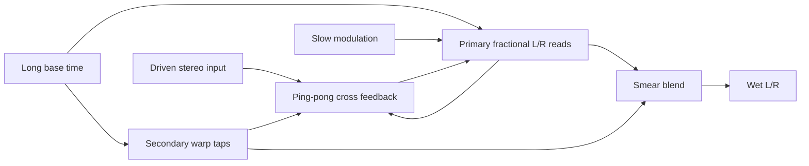
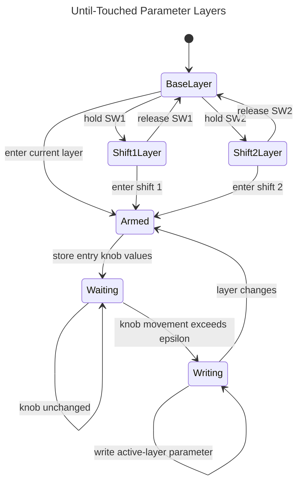
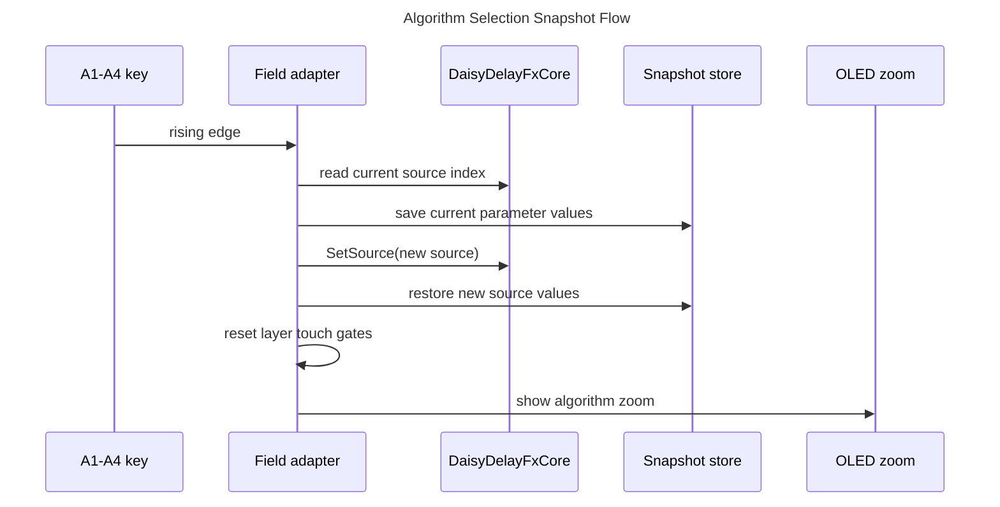
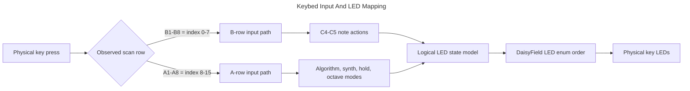

# Delay Algorithm Structure Visualization

This package compares four visualization approaches for explaining the
`Field_delay_bundle` code and algorithms:

- Markdown Mermaid as the source-controlled reference.
- Graphify-style knowledge graph extraction from curated algorithm notes.
- FigJam generated diagram for editable discussion.
- GoJS static web explorer for interactive comparison.

The model is based on the current local bundle sources:

- `MyProjects/_projects/Field_delay_bundle/README.md`
- `MyProjects/_projects/Field_delay_bundle/CONTROLS.md`
- `MyProjects/_projects/Field_delay_shared/FieldDelayFieldApp.h`
- `DaisyHost/include/daisyhost/DaisyDelayFxCore.h`
- `DaisyHost/src/DaisyDelayFxCore.cpp`
- `C:/Users/denko/Codex/_weekly/Embedded_DSP_GitHub_Digest/docs/reports/2026-06-03-daisy-delay-source-verified-research.md`

## Conclusion

For durable code and algorithm documentation, keep Mermaid as the canonical
source. For the most comprehensible reader-facing artifact, use the GoJS page in
this folder because it can filter algorithms, show source-backed details, and
grow by editing one data file. Use FigJam for editable reviews and Graphify for
relationship discovery, not as final proof of exact DSP behavior.

Personal opinion: the best long-term setup is a two-layer system: Mermaid in
Git as the exact documentation source, then the GoJS explorer generated or
maintained from the same algorithm model. FigJam and Graphify are useful, but
they should feed the canonical model rather than replace it.

Open the collector page:

`docs/visualizations/delay-algorithm-structure/index.html`

The collector page has two independent selectors:

- `Algorithms` on the left contains the four implemented bundle modes plus
  the five selectable Phantasmagoria standalone delay algorithms. The right
  details pane only uses these standalone delay algorithms.
- `Diagram Content` on the left selects Bundle overview, Selected algorithm, or
  Controls and synth.
- `Diagram Technology` above the main diagram window selects GoJS, Mermaid,
  Graphify, or FigJam for that content.
- `Extracted Algorithm Blocks` below the diagram shows source-backed internal
  DSP blocks for the selected delay type, including inputs and outputs.
- `External Source Extractions` lists named algorithms extracted from reference
  projects that are not yet part of the Field bundle firmware.
- `Literature Review Synthesis` shows the Phantasmagoria review, the five
  standalone delay algorithms, three delay modifiers, exclusions, gaps, and
  recommendation.

Standalone review:

- `docs/visualizations/delay-algorithm-structure/phantasmagoria-delay-literature-review.md`

Graphify output:

- `docs/visualizations/delay-algorithm-structure/graphify-corpus/graphify-out/graph.json`
- `docs/visualizations/delay-algorithm-structure/graphify-corpus/graphify-out/GRAPH_TREE.html`

FigJam diagram:

https://www.figma.com/board/kX5emp9EAmxTxOjb1ecj4u?utm_source=other&utm_content=edit_in_figjam&oai_id=&request_id=0ab4552c-85b5-4b64-811b-b5d9d7db05e3

## External Source Extractions

### Phantasmagoria [FuzzyLotus]

Source: `FuzzyLotus/Phantasmagoria`

Evidence checked:

- GitHub README describes spectral delay, reverse delay, room mode, halo mode,
  freeze, freeze evolution, reverb taps, and hi-fi dynamics.
- `phantasmagoria.cpp` contains the DSP source for the named blocks below.
- This dashboard separates standalone delay algorithms from delay modifiers.
  Hi-Fi dynamics and constant-power dry/wet mixing are treated as support
  blocks, not extracted delay algorithms.

Selectable standalone delay algorithms:

| Name | Type | Source-backed role |
|---|---|---|
| Main Spectral Delay Line | Delay core | SDRAM delay write/read path with smoothed forward delay and feedback. |
| Reverse Dual-Grain Reader | Reverse delay | Dual windowed grain read is crossfaded with the forward read through SW1. |
| Smear Multi-Tap Diffusion | Diffusion | SW2 adds widened +10 ms and +25 ms taps into the audible wet and feedback path. |
| Echo Chamber Reverb Taps | Reverb | Separate reverb delay with fixed 83, 151, 227, and 311 ms taps. |
| Freeze Voice Bank | Freeze | Three freeze buffers hold or accumulate frozen audio layers. |

Delay modifiers kept in the review, not in the right details algorithm panel:

| Name | Type | Source-backed role |
|---|---|---|
| Tri-LFO Tape Warble | Delay-time modulation | Three sine LFOs modulate read time for tape-like instability. |
| Erosion Repeat Aging Filter | Repeat aging | SW3 progressively darkens and attenuates the audible delay read and feedback. |
| Freeze Evolution Drift | Freeze modulation | SW4 adds ultra-slow drift to frozen voices while freeze is active. |

## Algorithm Set

| Type-first label | Source project | Current function | Algorithm basis |
|---|---|---|---|
| Tape [multifx] | `balazsbencs/daisy-multifx-pedal` | `ProcessMultiFx` | Modulated tape-style circular delay with tone, grit, flutter, smoothed time, and freeze-like hold behavior. |
| Tank [reverb] | `Farmer2K5/daisy-reverb-playground` | `ProcessReverbPlayground` | Four-line damped feedback delay network with diffusion, early reflections, width, and tank size. |
| Texture [FunBox] | `GuitarML/FunBox` | `ProcessFunBox` | Multi-tap texture delay with normal taps, grain tap, reverse accent, drift, smear, freeze, and cross-feedback. |
| Long [sdram] | `Farmer2K5/daisy-sdram-delaylines` | `ProcessSdramDelaylines` | Long fractional stereo delay with external-buffer behavior, LFO modulation, warp taps, smear, and ping-pong feedback. |

## Bundle Code Architecture



## Signal Path Overview



## Per-Algorithm Signal Diagrams

### Tape [multifx]



### Tank [reverb]



### Texture [FunBox]



### Long [sdram]



## Control And UI Diagrams







## Approach Comparison

| Approach | Strongest use | Weakest use | Fit for code structure | Fit for DSP signal flow | Best role |
|---|---|---|---:|---:|---|
| Markdown Mermaid | Versioned docs, reviews, exact control-flow invariants | Large exploratory graphs | High | High | Canonical source |
| GoJS web explorer | Interactive comparison and future expansion | Small one-off diagrams | High | High | Main reader experience |
| FigJam generated diagram | Editable workshop artifact | Long-term exact source of truth | Medium | Medium | Stakeholder discussion |
| Graphify knowledge graph | Relationship discovery across notes and code summaries | Sample-accurate signal flow | Medium | Low-Medium | Ingestion and discovery |

Recommended operating model:

1. Add or change an algorithm in `data/algorithms.js`.
2. Update the Mermaid source in this README when the structure changes.
3. Refresh the GoJS page by reloading `index.html`.
4. Regenerate the FigJam diagram only for review sessions.
5. Re-run Graphify when the corpus grows enough that new relationships matter.

## Verification Notes

Commands run from the DaisyExamples repo root:

```powershell
node --check docs\visualizations\delay-algorithm-structure\data\algorithms.js
node -e "const fs=require('fs'); const h=fs.readFileSync('docs/visualizations/delay-algorithm-structure/index.html','utf8'); const scripts=[...h.matchAll(/<script>([\s\S]*?)<\/script>/g)].map(m=>m[1]); scripts.forEach(s=>new Function(s)); console.log(scripts.length)"
```

Result: pass. The page has one inline script and it compiles.

Graphify semantic Markdown extraction was attempted first:

```powershell
& C:\Users\denko\.cache\codex-runtimes\codex-primary-runtime\dependencies\python\python.exe -m graphify extract docs\visualizations\delay-algorithm-structure\graphify-corpus --no-cluster --out docs\visualizations\delay-algorithm-structure\graphify-generated --max-concurrency 1
```

Result: blocked because no Graphify LLM backend API key was visible in this
shell. The exact Graphify error was:

```text
error: no LLM API key found. Set GEMINI_API_KEY or GOOGLE_API_KEY (gemini), MOONSHOT_API_KEY (kimi), ANTHROPIC_API_KEY (claude), OPENAI_API_KEY (openai), DEEPSEEK_API_KEY (deepseek), or pass --backend.
```

Fallback Graphify no-LLM AST extraction was then run against
`graphify-corpus/delay_bundle_structure.cpp`, a source-shaped seed that mirrors
current bundle code names and call relationships:

```powershell
& C:\Users\denko\.cache\codex-runtimes\codex-primary-runtime\dependencies\python\python.exe -m graphify update docs\visualizations\delay-algorithm-structure\graphify-corpus --no-cluster --force
& C:\Users\denko\.cache\codex-runtimes\codex-primary-runtime\dependencies\python\python.exe -m graphify tree --graph docs\visualizations\delay-algorithm-structure\graphify-corpus\graphify-out\graph.json --output docs\visualizations\delay-algorithm-structure\graphify-corpus\graphify-out\GRAPH_TREE.html --label "Field Delay Bundle Structure"
& C:\Users\denko\.cache\codex-runtimes\codex-primary-runtime\dependencies\python\python.exe -m graphify diagnose multigraph --graph docs\visualizations\delay-algorithm-structure\graphify-corpus\graphify-out\graph.json --json
```

Result: pass. Graphify generated 88 nodes and 152 links. The multigraph
diagnostic reported no missing endpoints, dangling endpoints, self loops,
duplicate edges, or same-endpoint collapse groups.

Browser check: a Playwright render using temporary `playwright-core` and the
system Chrome binary successfully loaded the page after the diagram technology
selector change. It verified four algorithm buttons, three content views, four
diagram technology buttons, selectable Mermaid, Graphify, and FigJam panes, and
no 1440px horizontal overflow.

Current extracted-block dashboard change was verified with local Node checks:
the model reports `tape:5,tank:5,texture:5,long:5`, and the HTML still has one
compiling inline script.

## Expandability Contract

To add a new delay algorithm later:

1. Add one entry to `data/algorithms.js`.
2. Add one Markdown note to `graphify-corpus/`.
3. Add a Mermaid per-algorithm signal diagram to this README.
4. Re-run Graphify if you want the knowledge-graph output refreshed.
5. Open `index.html` and confirm the selector, graph, details, and tables render.
