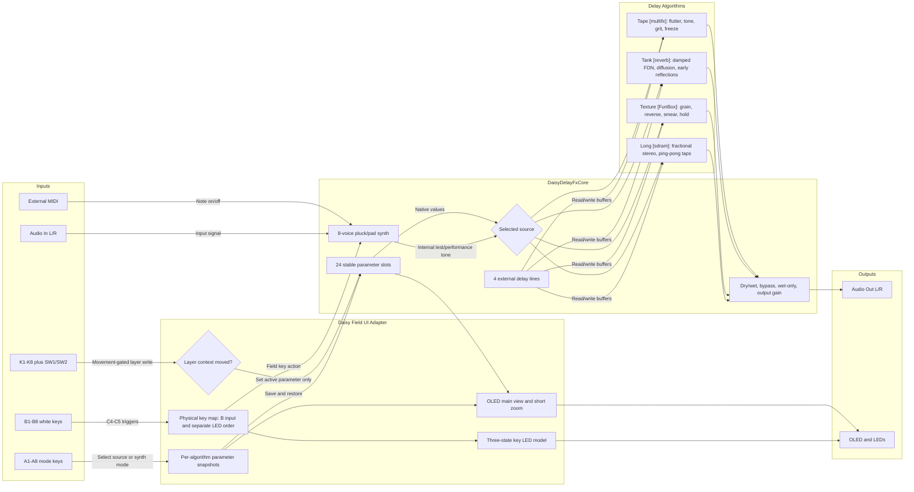

# FigJam Diagram Brief

Generated FigJam diagram:

https://www.figma.com/board/kX5emp9EAmxTxOjb1ecj4u?utm_source=other&utm_content=edit_in_figjam&oai_id=&request_id=0ab4552c-85b5-4b64-811b-b5d9d7db05e3

## Purpose

Explain the `Field_delay_bundle` firmware and shared DaisyHost delay core to a
reader who needs to understand:

- How Field controls reach shared DSP parameters.
- How audio, MIDI, and B-row test notes enter the selected algorithm.
- Why Tape, Tank, Texture, and Long are structurally different.
- Where the code keeps state that must remain stable during the audio callback.

## Current FigJam Diagram Scope

The generated diagram is a single source-backed flowchart with these lanes:

1. Inputs: audio, MIDI, B keys, A keys, knobs, switches.
2. Field UI adapter: physical key mapping, knob layer gate, snapshots, OLED, LEDs.
3. DaisyDelayFxCore: synth, parameters, source switch, delay storage, final mixer.
4. Algorithms: Tape, Tank, Texture, Long.
5. Outputs: audio output and display output.

## Mermaid Source Used For FigJam

## Recommended Manual FigJam Refinements

- Split the single generated flowchart into four side-by-side algorithm insets
  if it becomes crowded during review.
- Add sticky notes with code references:
  - `DaisyDelayFxCore.cpp:323` for `Process`.
  - `DaisyDelayFxCore.cpp:776` for stable parameter slot rebuild.
  - `FieldDelayFieldApp.h:332` for movement-gated knob writes.
  - `FieldDelayFieldApp.h:135` for keybed scan mapping.
- Keep the FigJam file as a review artifact. Update the Mermaid and GoJS data
  files first when code behavior changes.
