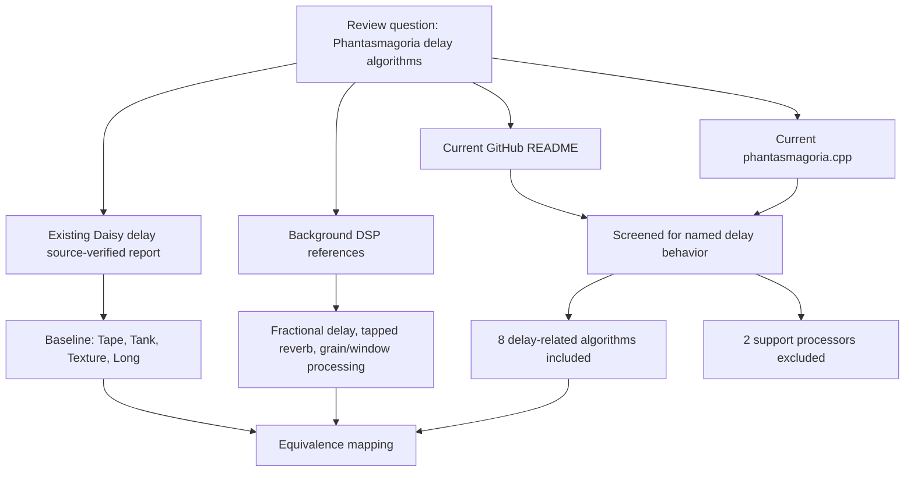
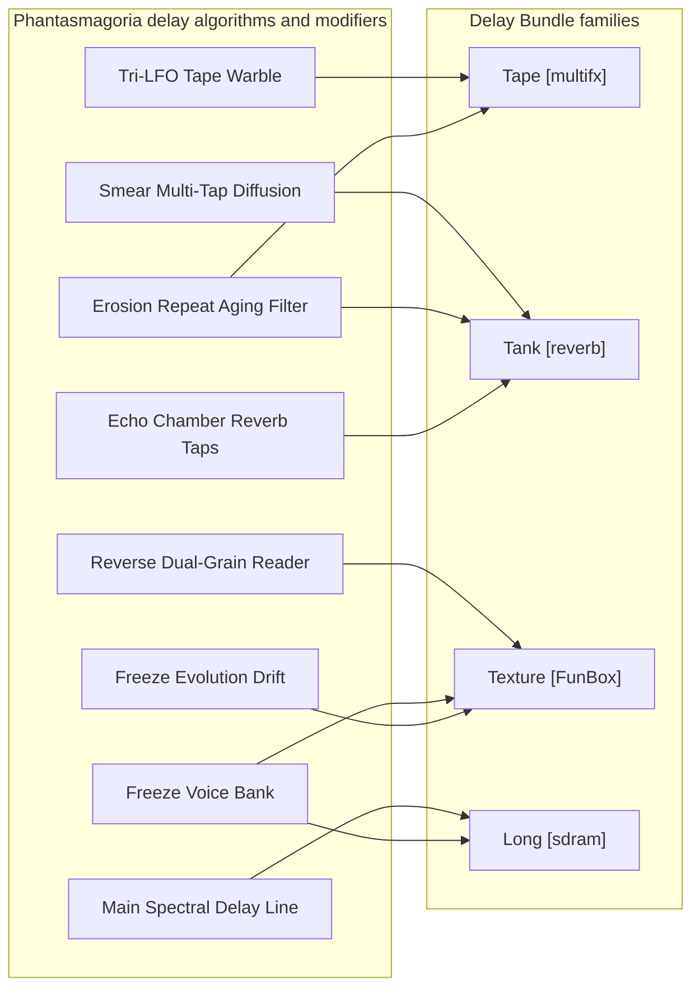

# Phantasmagoria Delay Algorithms Review

## Executive Summary

Conclusion: `FuzzyLotus/Phantasmagoria` adds five standalone delay algorithms and three delay modifiers that are useful to compare against the existing Delay Bundle modes.

Personal opinion: the strongest practical additions are Reverse Dual-Grain Reader, Smear Multi-Tap Diffusion, Freeze Voice Bank, and Freeze Evolution Drift. They add behavior that is not already obvious in Tape [multifx], Tank [reverb], Texture [FunBox], or Long [sdram]. The main delay line and echo-chamber taps are valuable references, but less urgent as new bundle modes because the current bundle already has long-delay and tank/reverb coverage.

The right-side algorithm details panel should use only the five standalone delay algorithms: Main Spectral Delay Line, Reverse Dual-Grain Reader, Smear Multi-Tap Diffusion, Echo Chamber Reverb Taps, and Freeze Voice Bank. Tri-LFO Tape Warble, Erosion Repeat Aging Filter, and Freeze Evolution Drift are delay modifiers. `Hi-Fi Dynamics Soft Clip` and `Constant-Power Dry/Wet Mixer` are documented as support processors, not delay algorithms.

## Research Question

Which `Phantasmagoria` delay algorithms are reusable or conceptually equivalent to the Field Delay Bundle families: Tape [multifx], Tank [reverb], Texture [FunBox], and Long [sdram]?

## Review Scope

This is a source-verified technical literature review, not a broad meta-analysis. The target is one current source project, so the strongest evidence is the project README and `phantasmagoria.cpp`, then the existing Daisy delay source-verified report, then general DSP literature for fractional delay, reverb delay networks, and grain/window processing.

Search date: 2026-06-05.

## Sources

| Source | Role in review |
|---|---|
| [FuzzyLotus/Phantasmagoria README](https://github.com/FuzzyLotus/Phantasmagoria) | Current project description, features, controls, license, and build context. |
| [Phantasmagoria `phantasmagoria.cpp`](https://github.com/FuzzyLotus/Phantasmagoria/blob/main/phantasmagoria.cpp) | Primary implementation evidence for delay buffers, taps, grain reader, freeze voices, smoothing, and switch behavior. |
| [Daisy delay source-verified report](C:/Users/denko/Codex/_weekly/Embedded_DSP_GitHub_Digest/docs/reports/2026-06-03-daisy-delay-source-verified-research.md) | Baseline comparison against the initial four bundle sources. |
| [DSPRelated fractional delay](https://www.dsprelated.com/freebooks/pasp/Fractional_Delay_Filtering_Linear.html) | Background for interpolated delay reads and time-varying delay behavior. |
| [DSPRelated artificial reverberation](https://www.dsprelated.com/freebooks/pasp/Artificial_Reverberation.html) | Background for tapped delay lines, reflections, comb/allpass/reverb structures. |
| [SFU granular synthesis overview](https://www.sfu.ca/~truax/gran.html) | Background for grain/window thinking used to interpret the reverse dual-grain reader. |

## Inclusion Criteria

- Present in the README or `phantasmagoria.cpp`.
- Delay-line, reverse/grain, diffusion/reverb-tap, freeze-buffer, delay-time-modulation, or repeat-aging behavior.
- Comparable to Tape [multifx], Tank [reverb], Texture [FunBox], or Long [sdram].
- Clear enough in source to name inputs, outputs, and control signals.

## Exclusions

| Excluded block | Reason |
|---|---|
| Hi-Fi Dynamics Soft Clip | Limiting and dynamics support stage, not a distinct delay algorithm. |
| Constant-Power Dry/Wet Mixer | Output integration and perceived-mix curve, not a delay algorithm. |

## Source Selection Diagram

## Conceptual Mapping

## Delay Algorithm And Modifier Evidence Matrix

| Phantasmagoria block | Classification | Source evidence | Closest bundle mode | Reuse priority |
|---|---|---|---|---|
| Main Spectral Delay Line | Standalone delay algorithm | `mainDelay.Write`, smoothed `sDelay`, and interpolated `mainDelay.Read`. | Long [sdram] | Medium |
| Reverse Dual-Grain Reader | Standalone delay algorithm | `GrainReader::Process` uses two windowed grain phases and blends with the forward read. | Texture [FunBox] | High |
| Smear Multi-Tap Diffusion | Standalone delay algorithm | SW2 adds widened taps around +10 ms and +25 ms to the wet delay path. | Tank [reverb] | High |
| Echo Chamber Reverb Taps | Standalone delay algorithm | Separate reverb delay taps at 83, 151, 227, and 311 ms. | Tank [reverb] | Medium |
| Freeze Voice Bank | Standalone delay algorithm | Three independent freeze buffers around 97, 149, and 199 ms hold/accumulate layers. | Texture [FunBox] | High |
| Tri-LFO Tape Warble | Delay modifier | Three LFOs modulate `modMs` / `modSamps` before delay reads. | Tape [multifx] | High |
| Erosion Repeat Aging Filter | Delay modifier | SW3 filters the audible delay read and compounds through feedback. | Tape [multifx] | Medium |
| Freeze Evolution Drift | Delay modifier | SW4 adds slow drift to frozen voices while freeze is active. | Texture [FunBox] | High |

## Algorithm Notes

### Tri-LFO Tape Warble

This is a delay-time modulation algorithm rather than a standalone delay buffer. It combines slow and faster oscillator components to perturb the read position. In bundle terms, it belongs closest to Tape [multifx], where pitch/time instability is part of the identity. It could also enrich Long [sdram] if depth is constrained.

Implementation risk: modulation depth must be bounded and smoothed because time-varying delay reads can create pitch bends or clicks.

### Main Spectral Delay Line

The source uses a main SDRAM buffer with interpolated reads and smoothed delay time. Despite the README's spectral language, the reviewed source evidence points mainly to a long interpolated delay substrate plus modulation and feedback behavior. It maps closest to Long [sdram].

Implementation risk: as a new bundle mode, it overlaps with existing long-delay storage. It is better used as a reference for buffer access, smoothing, and reverse/smear integration.

### Reverse Dual-Grain Reader

The reverse reader is the most distinctive Phantasmagoria delay candidate. It reads through two overlapping grain windows and crossfades with the forward delay path through SW1. This maps closest to Texture [FunBox], because both use non-primary read positions to create time texture.

Implementation risk: the source-reviewed behavior was not auditioned here. A bundle implementation should start with conservative grain lengths and a visible reverse amount parameter.

### Smear Multi-Tap Diffusion

Smear adds secondary taps around the main read position. The current source explicitly widens the offsets to make the smear audible, then mixes those taps into the wet path and feedback behavior. This is a lightweight alternative to a denser FDN and maps closest to Tank [reverb].

Implementation risk: if the taps are too close, smear becomes inaudible; if too strong, repeats lose articulation.

### Erosion Repeat Aging Filter

Erosion is included because it processes the audible delay read and then compounds through feedback, so it changes the delay behavior itself. It is not a generic output filter. It maps most closely to Tape [multifx] as repeat aging and to Tank [reverb] as damping/decay color.

Implementation risk: high erosion can make the algorithm feel like a dull low-pass rather than intentional repeat aging. Keep it tied to feedback and wet path state.

### Echo Chamber Reverb Taps

The echo chamber uses fixed taps in a separate reverb delay. This maps to Tank [reverb], but it is not the same structure as the current four-line tank matrix. It is better described as fixed-tap chamber delay than as FDN.

Implementation risk: fixed taps are easier to implement than a feedback matrix, but they can sound static unless blended with modulation, filtering, or diffusion.

### Freeze Voice Bank

The freeze system uses three short buffers to hold or accumulate layered audio. This is more advanced than a simple write-stop freeze because independent voices can create a held texture rather than only preserving the active delay buffer. It maps to Texture [FunBox] and partly to Long [sdram].

Implementation risk: freeze must not allocate in the audio callback, and accumulated layers need gain control.

### Freeze Evolution Drift

Freeze Evolution adds slow movement to the freeze voices. It is not a separate delay line, but it is a delay-memory behavior and pairs directly with Freeze Voice Bank. It maps closest to Texture [FunBox].

Implementation risk: drift depth should be low and bounded; otherwise the frozen layer becomes unstable or pitch-chaotic.

## Thematic Synthesis

| Theme | Finding | Bundle implication |
|---|---|---|
| Delay-line substrate | Phantasmagoria uses a main interpolated delay path suitable for smooth read-time movement. | Reinforces Long [sdram] and Tape [multifx] architecture choices. |
| Time reversal and grains | Reverse is implemented through windowed reads rather than a simple backwards pointer. | Strong candidate for a Texture [FunBox] reverse mode. |
| Spatial diffusion | Smear and echo-chamber taps use simple delayed copies to widen and spatialize repeats. | Useful lightweight complement to Tank [reverb]. |
| Repeat aging | Erosion is part of the wet/read/feedback loop, so it is a real delay behavior. | Add as an optional character control, not a standalone mode. |
| Frozen memory | Freeze Voice Bank separates held layers from the main delay path. | High-value upgrade for Texture-style freeze/hold. |

## Gaps

- No local Phantasmagoria build was run in this review.
- No hardware CPU, SRAM, SDRAM, or flash measurement was collected.
- Reverse/grain behavior was source-reviewed but not auditioned.
- Phantasmagoria targets Terrarium/Petal-style controls; Field mapping would need a separate adaptation pass.
- GPL-3.0 license constraints require care before direct code porting into non-GPL projects.

## Recommendation

For a future Delay Bundle expansion, implement or prototype in this order:

1. Reverse Dual-Grain Reader as a Texture/Reverse mode.
2. Smear Multi-Tap Diffusion as a Tank/Texture diffusion option.
3. Freeze Voice Bank plus Freeze Evolution Drift as an improved freeze system.
4. Tri-LFO Tape Warble as a richer Tape modulation source.
5. Erosion Repeat Aging Filter as a delay-repeat character control.
6. Echo Chamber Reverb Taps as a simple fixed-tap chamber reference.
7. Main Spectral Delay Line only as a reference unless a Phantasmagoria-specific combined mode is desired.

The dashboard data for this review lives in `data/algorithms.js`, and the rendered review appears in `index.html` under `Literature Review Synthesis`.
