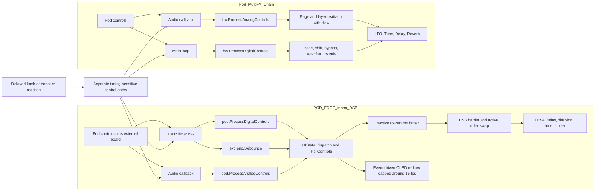
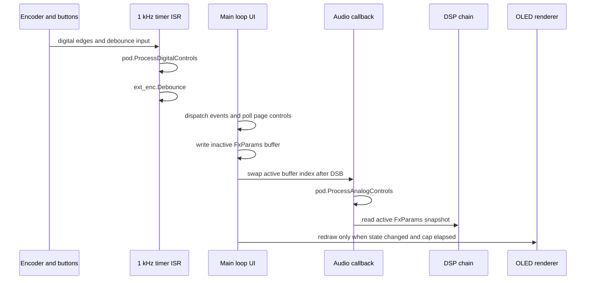
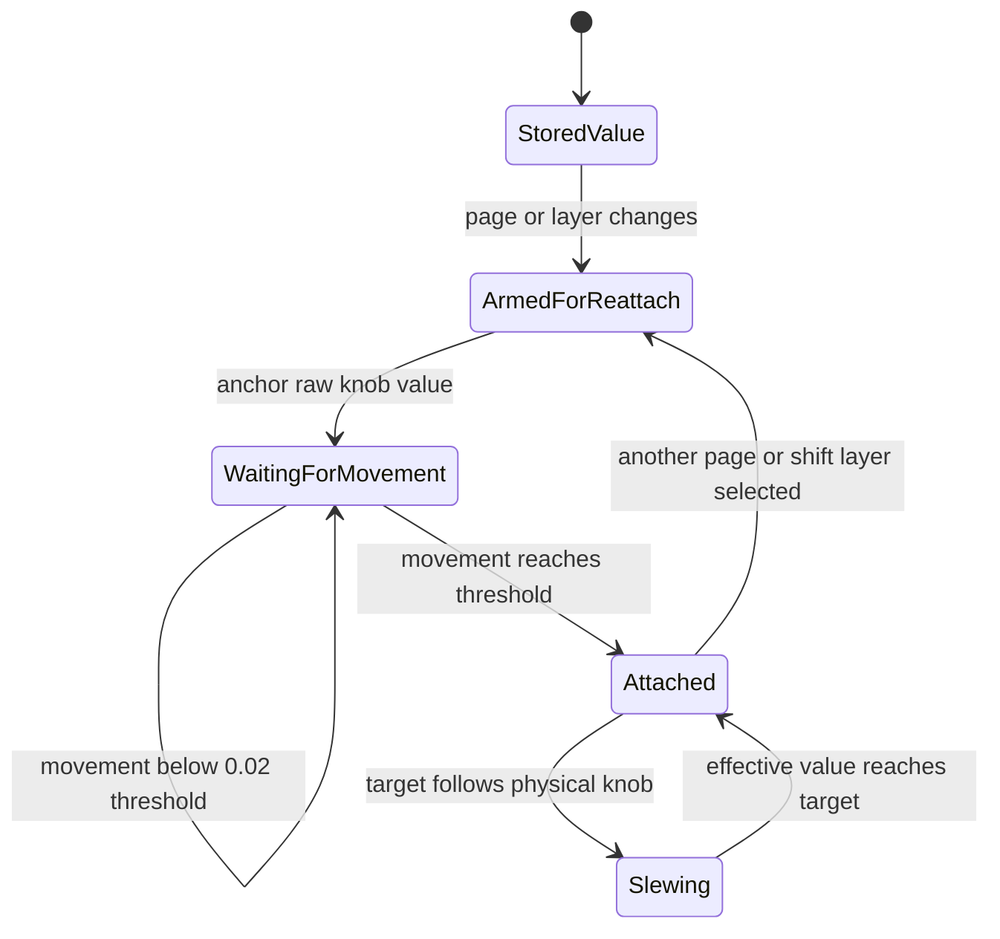
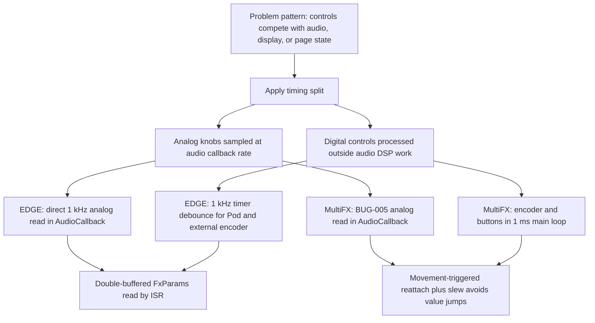

# Daisy Pod and Field Architecture Visualization Report

Generated: 2026-06-04
Expanded: 2026-06-05
Field extension: 2026-06-05

## Executive Summary

The dashboard now compares four source-inspected firmware projects:
`POD_EDGE_mono_DSP`, `Pod_MultiFX_Chain`, `Field_AdditiveSynth`, and
`Field_Template_April`. The comparison is intentionally family-aware:
Pod-vs-Pod and Field-vs-Field views are used for control-surface-dependent
behavior, while Pod-vs-Field comparisons are limited to control-independent
architecture, timing ownership, state handoff, build footprint, and reference
value.

The best visualization approach remains a curated Mermaid plus GoJS combination.
Mermaid is the strongest durable source for docs and review because it is
text-native and versionable. GoJS is the strongest reading surface because it
lets the same architecture be explored interactively. Graphify is useful as a
discovery layer, but the raw AST graphs are too noisy to be the primary
explanation.

## Conclusions

`POD_EDGE_mono_DSP` is the higher-value responsiveness reference. It has the
explicit fix for sluggish or swallowed controls: digital controls are debounced
in a 1 kHz hardware timer, analog controls are sampled in the audio callback at
1 kHz, and parameter updates cross into the audio ISR through a double buffer.

`Pod_MultiFX_Chain` is the cleaner compact reference. It applies the same core
BUG-005 split, but without the extra hardware timer or external display stack:
analog controls run in the audio callback, digital controls run in the main
loop, and page/layer control jumps are avoided with movement-triggered reattach
and a 300 ms full-scale slew.

`Field_AdditiveSynth` is the higher-value Field engine reference. It has the
heavier runtime surface: TRS MIDI, eight additive voices, spectral presets,
pickup/catch page state, OLED, LEDs, Chorus, and ReverbSc. It also has prior
memory evidence as a known-good Field fallback target that was successfully
flashed.

`Field_Template_April` is the cleaner Field starter reference. It demonstrates
current Field control rules with `ParamBankSet`, banked pickup/catch, stored
logical knob LED values, tri-state key LEDs, OLED overview/zoom, external MIDI
note input, and a small mono synth core with much lower SRAM pressure.

## Personal Opinion

For future firmware architecture reviews, use Mermaid first and keep it in
project docs. Add GoJS when the topic involves timing, state, or reference
selection. Use Graphify to find symbols and relationships, then curate the
answer. Do not compare raw physical control counts across Pod and Field; compare
control behavior inside the hardware family and compare lifecycle/timing across
families.

## Artifacts

- Web dashboard: `index.html`
- Graphify tree, EDGE: `POD_EDGE_mono_DSP_graphify_tree.html`
- Graphify tree, MultiFX: `Pod_MultiFX_Chain_graphify_tree.html`
- Graphify JSON, EDGE: `graphify-json/POD_EDGE_mono_DSP_graph.json`
- Graphify JSON, MultiFX: `graphify-json/Pod_MultiFX_Chain_graph.json`
- Original FigJam diagram: <https://www.figma.com/board/1SoSoA89u2UiCnn636j1QV?utm_source=other&utm_content=edit_in_figjam&oai_id=&request_id=3fa51c00-b1f9-4b1f-8308-a395a9a3e5e9>
- Generated dashboard concept image: `assets/dashboard_concept.png`

## Dashboard Pages

The web dashboard now uses hash-routed dedicated views:

- `#overview`: executive comparison and family-aware comparison rule.
- `#architecture`: Pod-family, Field-family, and cross-family architecture.
- `#timing`: audio callback, timer ISR, and main-loop timing lanes with 0.00-1.00 ms timestamps.
- `#responsiveness`: implemented Pod fixes, Field pickup/catch behavior, and potential MultiFX improvements.
- `#cpu-memory`: current clean rebuild memory footprints for all four projects.
- `#io-peripherals`: Pod-only and Field-only control-surface comparisons.
- `#parameters`: Pod page models, Field bank/state models, and state ownership.
- `#build-config`: Make targets, linked sources, LGPL flags, outputs.
- `#test-results`: current build, QAE, host-test, and dashboard render results.
- `#logs`: command/evidence log and known limitations.
- `#report`: dashboard-native summary of this written report.
- `#figjam`: embedded FigJam diagram plus fallback URL.
- `#edge-graphify`: embedded EDGE Graphify tree.
- `#multifx-graphify`: embedded MultiFX Graphify tree.
- `#gojs`, `#graphify`, `#approach`: interactive graph, Graphify API-key setup, and approach ranking.

Mermaid diagrams are distributed onto related pages:

- Pod architecture diagram and Field architecture diagram: `#architecture`.
- EDGE timestamped sequence and Field main-loop timing sequence: `#timing`.
- Pod implemented fix flow and Field pickup/catch flow: `#responsiveness`.
- Field parameter ownership and MultiFX reattach state: `#parameters`.

## Source Evidence

| Claim | Evidence |
| --- | --- |
| EDGE targets Daisy Pod plus external OLED, encoder, BAK, CON | `MyProjects/_projects/POD_EDGE_mono_DSP/main.cpp:4`, `CONTROLS.md:5` |
| EDGE digital controls run in a 1 kHz timer | `POD_EDGE_mono_DSP/main.cpp:50-55`, `main.cpp:322-329` |
| EDGE analog controls run in the audio callback | `POD_EDGE_mono_DSP/main.cpp:131-141` |
| EDGE uses double-buffered params for ISR handoff | `POD_EDGE_mono_DSP/main.cpp:60-64`, `main.cpp:419-423` |
| EDGE event-driven OLED redraw is capped | `POD_EDGE_mono_DSP/main.cpp:425-440` |
| EDGE MEMORY records the sluggish-control fix | `POD_EDGE_mono_DSP/MEMORY.md:104` |
| MultiFX analog controls follow BUG-005 in the audio callback | `Pod_MultiFX_Chain/Pod_MultiFX_Chain.cpp:140-147`, `README.md:147-150` |
| MultiFX digital events are processed in the main loop | `Pod_MultiFX_Chain/Pod_MultiFX_Chain.cpp:231-266` |
| MultiFX smooth reattach uses movement threshold and 300 ms slew | `Pod_MultiFX_Chain/pod_multifx_pages.h:26-27`, `pod_multifx_pages.h:322-355` |
| MultiFX current docs report clean QAE and build | `Pod_MultiFX_Chain/README.md:187-203` |
| Field_AdditiveSynth uses pickup/catch page state | `Field_AdditiveSynth.cpp:589-624`, `CONTROLS.md:1-16` |
| Field_AdditiveSynth keeps controls/display in the main loop | `Field_AdditiveSynth.cpp:857-873` |
| Field_AdditiveSynth audio callback runs additive voices and global effects | `Field_AdditiveSynth.cpp:731-792` |
| Field_Template_April documents current Field control rules | `Field_Template_April/README.md:1-8` |
| Field_Template_April uses `ParamBankSet` and tri-state Field UI helpers | `Field_Template_April.cpp:132-155`, `foundation_examples/field_parameter_banks.h:22`, `foundation_examples/field_instrument_ui.h:110` |
| Field_Template_April starts ADC before audio and runs a 1 ms main loop | `Field_Template_April.cpp:764-794` |

## Current Verification

Current checks run on 2026-06-05:

| Project / Surface | Check | Result |
| --- | --- | --- |
| `POD_EDGE_mono_DSP` | `make clean; make` | PASS |
| `POD_EDGE_mono_DSP` | Daisy QAE linter | PASS, `0 error(s), 0 warning(s)` |
| `Pod_MultiFX_Chain` | `make clean; make` | PASS |
| `Pod_MultiFX_Chain` | Daisy QAE linter | PASS, `0 error(s), 0 warning(s)` |
| `Pod_MultiFX_Chain` | Visual Studio host page-control test | PASS, exit 0 |
| `Field_AdditiveSynth` | `make clean; make` | PASS |
| `Field_AdditiveSynth` | Daisy QAE linter | PASS, `0 error(s), 0 warning(s)` |
| `Field_Template_April` | `make clean; make` | PASS |
| `Field_Template_April` | Daisy QAE linter | PASS, `0 error(s), 0 warning(s)` |
| Static dashboard | Playwright desktop/mobile render | PASS, no page or console errors |

Current clean rebuild footprints:

| Project | FLASH | SRAM | SDRAM |
| --- | ---: | ---: | ---: |
| `POD_EDGE_mono_DSP` | `104360 B / 128 KB` (`79.62%`) | `315036 B / 512 KB` (`60.09%`) | `384012 B / 64 MB` (`0.57%`) |
| `Pod_MultiFX_Chain` | `82992 B / 128 KB` (`63.32%`) | `446640 B / 512 KB` (`85.19%`) | `192012 B / 64 MB` (`0.29%`) |
| `Field_AdditiveSynth` | `115640 B / 128 KB` (`88.23%`) | `469864 B / 512 KB` (`89.62%`) | `0 B / 64 MB` (`0.00%`) |
| `Field_Template_April` | `114128 B / 128 KB` (`87.07%`) | `52832 B / 512 KB` (`10.08%`) | `0 B / 64 MB` (`0.00%`) |

Hardware validation was not run for the dashboard expansion.

## Graphify LLM API Key

Graphify reads LLM API keys from environment variables. For a temporary
PowerShell session:

```powershell
$env:GEMINI_API_KEY = "your_key_here"
graphify extract MyProjects\_projects\POD_EDGE_mono_DSP --backend gemini --out docs\visualizations\pod-control-architecture\graphify-edge-semantic
```

For a persistent Windows user environment variable:

```powershell
[Environment]::SetEnvironmentVariable("GEMINI_API_KEY", "your_key_here", "User")
[Environment]::GetEnvironmentVariable("GEMINI_API_KEY", "User")
```

Other supported variables from the CLI are `GOOGLE_API_KEY`, `OPENAI_API_KEY`,
`ANTHROPIC_API_KEY`, `MOONSHOT_API_KEY`, and `DEEPSEEK_API_KEY`.
Do not commit API keys to the repository.

## Mermaid: Architecture Comparison



## Mermaid: EDGE Timing Flow



## Mermaid: MultiFX Reattach State



## Mermaid: Responsiveness Difference



## Graphify Results

Graphify full semantic extraction was unavailable because no LLM API key was
configured for the CLI. The non-LLM `graphify update --no-cluster --force` path
did work and produced AST-level graphs:

| Project | Nodes | Raw edges | Post-build edges | Usefulness |
| --- | ---: | ---: | ---: | --- |
| `POD_EDGE_mono_DSP` | 1457 | 1456 | 1432 | Good for symbol discovery, too dense as the primary explanation |
| `Pod_MultiFX_Chain` | 60 | 112 | 96 | Readable enough to support the curated diagrams |
| `Field_AdditiveSynth` | not generated | not generated | not generated | Recommended next semantic extraction target |
| `Field_Template_April` | not generated | not generated | not generated | Recommended next semantic extraction target |

This supports the main conclusion: extraction graphs are helpful, but the final
explanation needs curated timing and responsibility views.

Suggested Field semantic extraction commands after configuring an API key:

```powershell
graphify extract MyProjects\_projects\Field_AdditiveSynth --backend gemini --out docs\visualizations\pod-control-architecture\graphify-field-additive-semantic
graphify extract MyProjects\_projects\Field_Template_April --backend gemini --out docs\visualizations\pod-control-architecture\graphify-field-template-semantic
```

## Approach Ranking

| Approach | Best use | Limitation |
| --- | --- | --- |
| Mermaid | Durable source-controlled diagrams, precise review comments | Static unless hosted by a viewer |
| GoJS | Interactive exploration and side-by-side comparison | More code to maintain |
| Graphify | Symbol discovery and raw relationship inventory | Noisy without curation, semantic mode needs API key |
| FigJam | Shared visual review and quick stakeholder discussion | Less source-traceable than repo-local Markdown |
