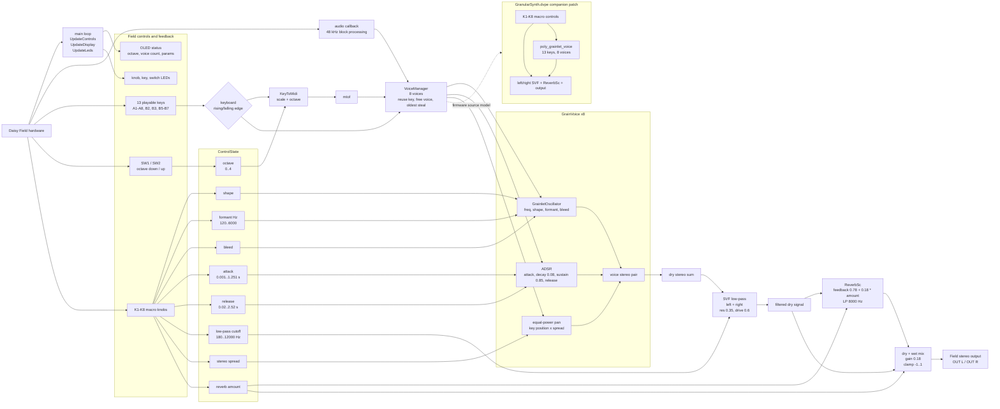

# GranularSynth Mermaid Diagram

This diagram reflects the current `GranularSynth.cpp` firmware structure. The
firmware uses 13 Field keyboard notes with an 8-voice allocator; the companion
`GranularSynth.dvpe` starter patch now represents that polyphonic section as
one compact `poly_grainlet_voice` block with shared filter, reverb, output, and
K1-K8 macro controls.

