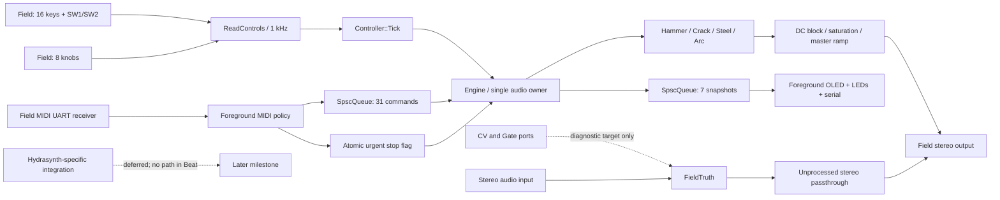

# Context

The instrument and diagnostic are different firmware images. Beat ignores audio inputs and keeps
both DAC codes and Gate Out at zero/false. Truth provides the measurement path.
No MIDI parser, display writer or logger has a reference to Engine in a concurrent context:
the foreground sends value-only commands, and receives value-only snapshots.
The single audio owner is the primary race-avoidance mechanism. The two SPSC queues have
one producer and one consumer each, reject overflow and never overwrite unread slots.
Source: firmware/HydraPulse.cpp, firmware/FieldTruth.cpp, src/app/Engine.*.

