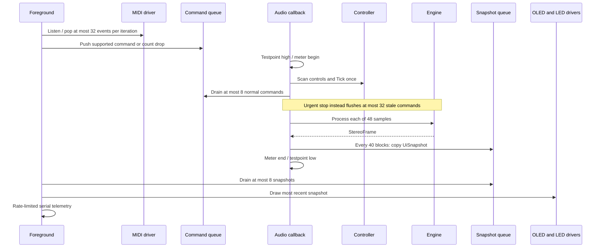

# Firmware Ownership

Expected firmware sample rate is 48,000 Hz, block length is 48 frames and scan rate is 1,000 Hz.
These are configuration values, not measured physical clock accuracy. A snapshot is offered
every 40 callbacks (25 Hz). The foreground consumes at most eight per iteration and displays
only the last. Normal MIDI command consumption is at most eight per callback; urgent stop
does not wait behind note traffic.
CpuLoadMeter brackets callback work and uses System ticks, not Cortex cycle counts.
The testpoint pulse includes the user callback body but excludes library interrupt entry,
sample conversion outside the callback and exit overhead. Late-start and overrun counters
are indicators, not a complete DMA underrun detector. Measure the instrumented interval
and interrupt/codec behavior on the actual hardware before interpreting headroom.

