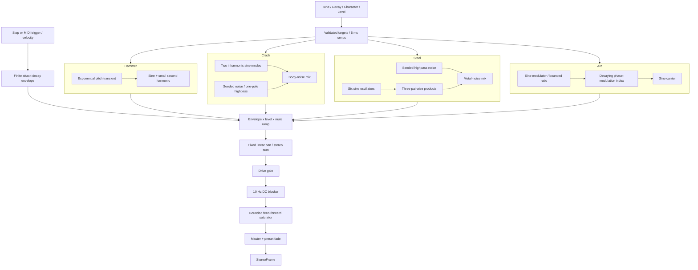

# Synthesis

All four algorithms are original in this package, not ports of the manuals or unverified community DSP.
The shared 1,025-entry sine table is initialized once before audio starts. Noise is xorshift32
with per-voice deterministic seeds. No audio processing requests random bytes from a peripheral.
Hammer uses a unipolar exponentially decaying pitch transient; Character scales its amount.
Crack blends two sine modes with high-passed noise. Steel sums three products of six sine
partials and adds shaped noise. Arc uses feed-forward phase modulation; its Character changes
modulator ratio and index, not a feedback gain.

The attack is 1 ms for Hammer/Crack/Arc and 0.5 ms for Steel. Decay is a T60-like parameter:
coefficient = exp(-ln(1000)/(Fs*T60)). Release is a 5 ms linear ramp from the current envelope
value to exact zero. Retrigger starts from the current amplitude and retains oscillator phase.
The pitch/modulation transient has its own 1 ms attack from current state, avoiding an
instantaneous phase-modulation jump on Arc retrigger. Frequency, Character, Level and the
noise-filter coefficient use 5 ms ramps; changing a decay coefficient changes slope,
not the current envelope value. The noise-filter coefficient is bounded between zero and one.
The master is capped by the mathematical output path; this is not a true-peak/lookahead limiter.
Harmonics from phase modulation, ring products and saturation still require aliasing/listening QA.
No resonant filter or delay feedback loop is present in this candidate.

