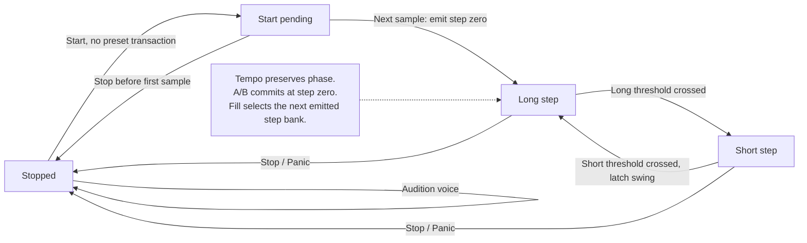

# Clock Transport

The step grid is always 16 steps. Internally indices are 0..15; the manual labels them 1..16.
At Start, step zero emits on the next processed sample, then GrooveClock counts subsequent
samples. At 120 BPM without swing, a boundary occurs every 6,000 samples at 48 kHz.
For normalized swing w in [0,1], s = round(400*w). Phase increment is BPM_micro * 4 * 1000.
Long threshold is Fs*60*1,000,000*(1000+s); short threshold substitutes (1000-s).
Thus each constant-tempo swing pair retains exactly two nominal step durations before
sample quantization. Remainder is retained, so error against the quantized-BPM rational
reference stays below one sample. The display reports 50..70 percent swing.
This is a sample-domain property, not a claim about crystal tolerance or MIDI jitter.

An A/B request changes the edit bank immediately, and changes the playback bank at the
next step-zero boundary. A request while stopped sets the bank immediately.
Fill substitutes its pattern at the next step boundary while held and leaves transport
phase/step number unchanged. Release returns to the active A/B bank at the next boundary.
It is not an automatic one-bar Fill latch. Stop releases sounds; Start restarts the grid.
Incoming MIDI TimingClock and Continue are intentionally ignored, not partly implemented.

