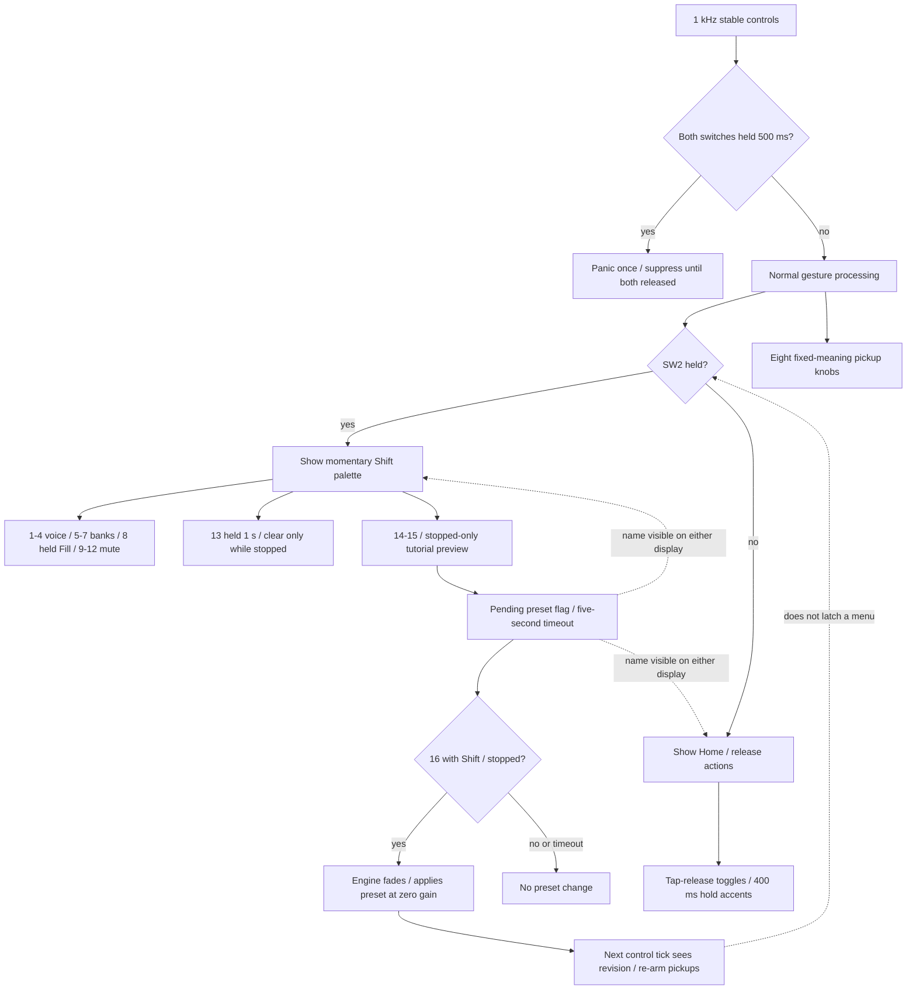

# Controls Menu

There is no menu stack, machine browser, patch hierarchy or desktop editor requirement.
The Shift palette is a temporary action legend. Preset preview is a five-second pending
selection shown on Home, not a browsing page; it never changes sound until confirmed.
SW1 is a tap-release transport action. Holding both switches cancels any pending transport
tap, so releasing the panic chord cannot accidentally restart playback.

Knob mapping: 1 Tune, 2 Decay, 3 Character, 4 Level, 5 Tempo (40..240 BPM),
6 Swing (50..70 percent), 7 Drive, 8 Master. All use pickup; sound pickups re-arm on
voice selection, all pickups re-arm after preset load. A pickup bit of one means not captured.
Knob values and target values shown in the manual are normalized percentages, not voltages.

Shift+13 must be held for one second while stopped to clear the selected track in the edit bank.
Preset load and clear are unavailable during playback. Ordinary taps toggle, rather than
cycling through velocity states. Long step hold toggles its accent and ensures the step exists.
Keys consumed by Shift cannot become ordinary step edits when the modifier is released first.
Physical labels remain provisional until P0 validates FieldAdapter.h mapping on the actual unit.

Preset preview/loading are independent flags, not persistent menu pages. Releasing SW2
returns the display to Home even if a preview is still pending; loading while SW2 is held
does not force the palette closed. The next control tick re-arms pickup after the engine revision changes.
