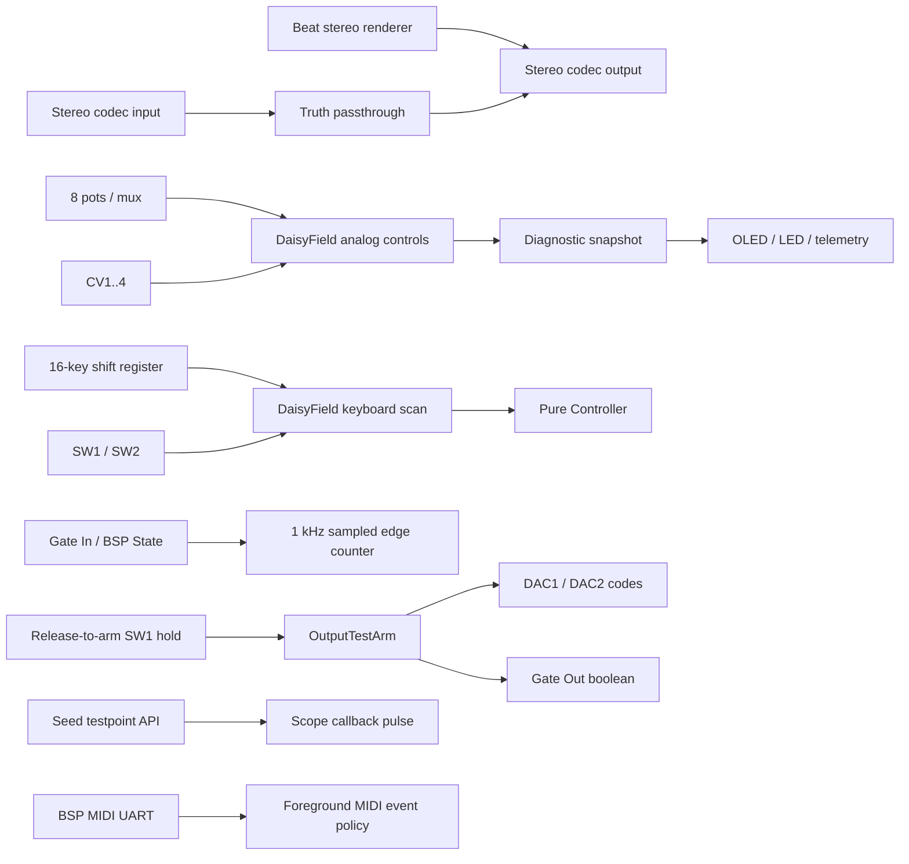

# Field Hardware

The inspected upstream daisy_field.cpp uses the Field BSP, not an invented per-pin HAL.
Its Rev2 constants associate Gate In with Seed D0, Gate Out with D15, pot mux ADC with D16,
CV inputs with D17/D18/D25/D24, DAC outputs with D23/D22, the two switches with D30/D29,
and the keyboard shift-register signals with D26/D27/D28. These are source observations,
not a substitute for the schematic and board-revision check. Do not wire directly to those
pins from this document. Use the stock Field connectors and qualified fixture.

The inspected Seed implementation maps the testpoint to PG14 and the Seed LED to PC7.
Testpoint accessibility and probe grounding on the assembled Field are not verified.
CV inputs are reported in BSP normalized bipolar units; do not interpret 10,000 telemetry
units as a fixed number of volts without calibration. DAC codes are 0,1024,2048,3072,4095.
Voltage, polarity, loading, limits and ground reference remain bench-measured fields.
Gate sampling at 1 kHz cannot prove detection of shorter-than-scan pulses.
The musical image holds CV/Gate outputs off and has no external audio-through lane.
Sources: source ledger entries DAISY-FIELD, DAISY-SEED and DAISY-SYSTEM.

