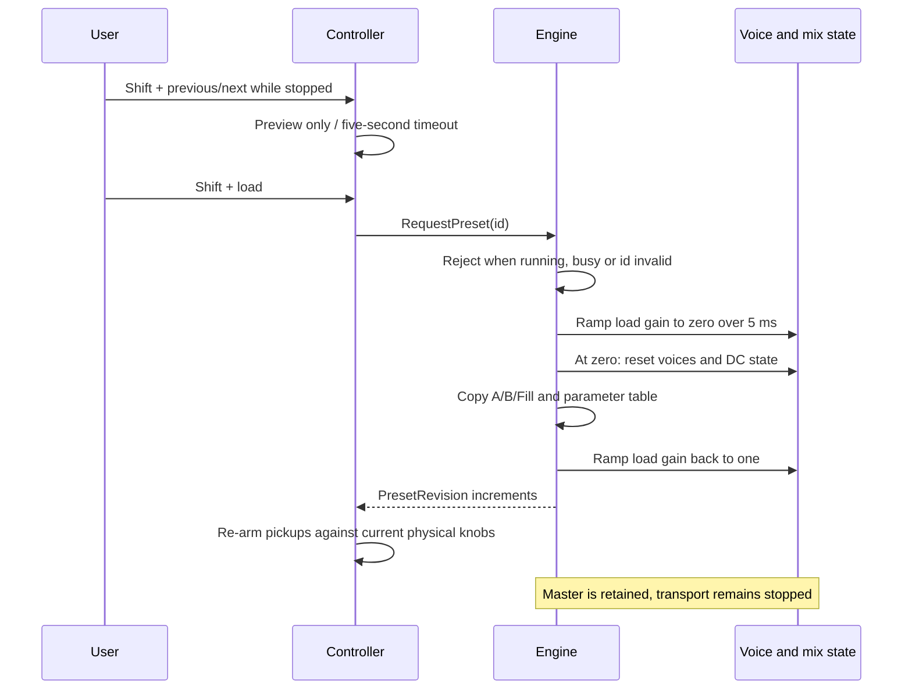

# Preset Transaction

Presets are generated from presets/tutorials.json by tools/generate_presets.py.
The JSON is the editable source; the checked-in C++ table is a build asset whose exact
content is checked. There are eight presets with three banks and four voices each.
The preset contains rhythm masks, accents, sound parameters, BPM, swing and drive.
It does not contain master volume, which remains under the user's control.

There is no persistent save in this version. Edits live in RAM and are lost at power-down,
reset or confirmed preset load. No blank "save" menu implies otherwise.
The renderer exercises A/B, Fill and panic within each tutorial's ten-second host scenario.
Later storage requires a versioned schema, CRC, bounds checks, two-slot atomic commit,
power-interruption tests and a non-audio owner for flash operations.

