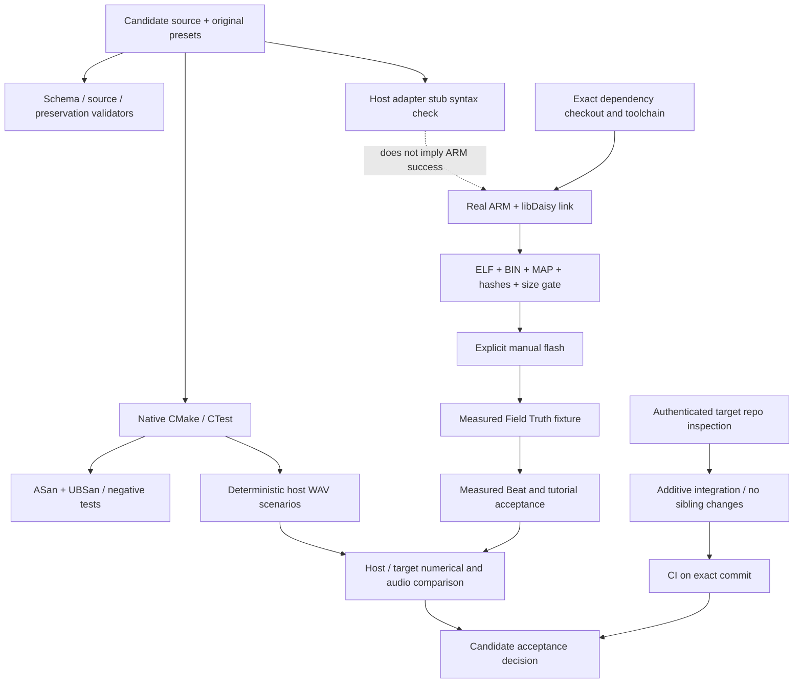

# Verification

A PASS belongs to a specific executed test on a specific artifact. Host tests cover software
contracts, not ARM timing, codec gain, analog voltage or instrument ergonomics. The contract
stub compiles source against locally declared API shapes and must never be reported as
libDaisy or ARM validation. The target script refuses to substitute a native compiler.

Hardware records use VERIFIED, DERIVED, PROPOSED, ASSUMED, HOLD or NOT_RUN.
A VERIFIED hardware row requires fixture identity, firmware hash, raw artifact paths and
measurement method. Simulated waveforms cannot occupy measured-hardware fields.
Public CI never runs DFU/OpenOCD/programming commands. Missing toolchain or missing
physical hardware holds those gates without erasing completed source work.

