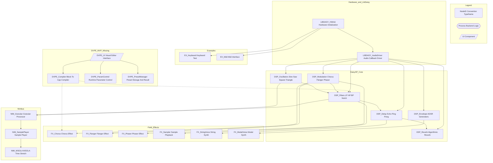

# Noderr - Architectural Flowchart

**Purpose:** Mermaid architecture with canonical NodeIDs tracked in `noderr_tracker.md` and specified in `noderr/specs/`.

---

---

## Component Summary

### Existing Components Implemented
- LIBDASY_HWInit
- LIBDASY_AudioDriver
- DSP_Oscillators
- DSP_Filters
- DSP_Delay
- DSP_Reverb
- DSP_Envelope
- DSP_Modulation
- FX_Chorus
- FX_Flanger
- FX_Phaser
- FX_Sampler
- FX_StringVoice
- FX_ModalVoice
- NIM_Granular
- NIM_SamplePlayer
- NIM_WSOLA
- EX_Keyboard
- EX_Midi

### Missing Components Required For MVP
- DVPE_UI
- DVPE_Compiler
- DVPE_ParamControl
- DVPE_PresetManager
