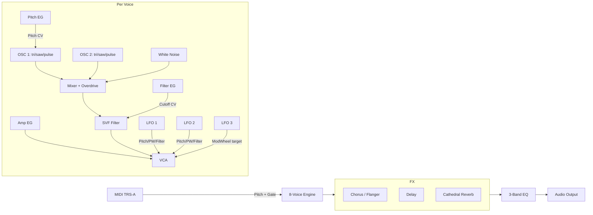
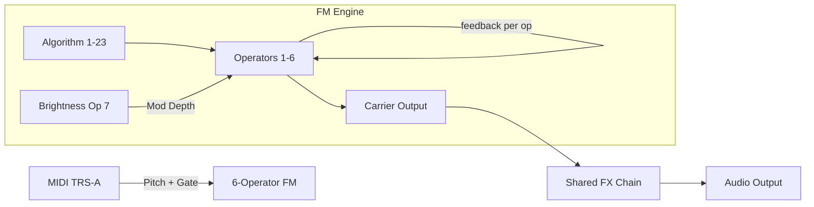

> **[INSTANCE: DAISY-FIRMWARE]** NodeID: `SYNTH_Pollen8` | Group: Reference Synths | Status: VERIFIED

# SYNTH_Pollen8 — Pollen8 VA+FM 2.0

**Type:** Reference Synthesizer (pre-compiled binary, closed source)
**Hardware Target:** Daisy Field
**Author:** Hammond Eggs Music © 2021–2025
**Full Docs:** https://hammondeggsmusic.ca/daisy/pollen8_vafm_2.html

---

## Purpose & Responsibilities

Pollen8 VA+FM 2.0 is an 8-voice polyphonic synthesizer that demonstrates the full capabilities of the Daisy Field platform. It serves as a **reference implementation** within the firmware Noderr instance, showing how the verified DSP building blocks (`DSP_Oscillators`, `DSP_Filters`, `DSP_Envelope`, `DSP_Modulation`, `FX_Chorus`) combine into a production-grade instrument.

This NodeID is **not built from source** — it is tracked as a verified reference that cross-documents the DSP_ and FX_ specs with a real-world working example.

---

## DSP NodeID Cross-References

| SYNTH_Pollen8 Component | Corresponding Noderr NodeID |
|-------------------------|----------------------------|
| 2× oscillators per voice (triangle/saw/pulse morph + sync) | `DSP_Oscillators` |
| State-variable filter (LP/HP/BP/notch, sweepable) | `DSP_Filters` |
| Amplitude + Filter + Pitch envelopes (ADSR) | `DSP_Envelope` |
| 3× LFOs (poly/single, free/sync) | `DSP_Modulation` |
| Chorus ("Hera", Flanger, "Buckets") | `FX_Chorus` / `FX_Flanger` |
| Delay (up to 1.36s) + Cathedral reverb | `DSP_Delay` / `DSP_Reverb` |
| 6-operator FM engine with 23 algorithms | `DSP_Oscillators` (FM variant) |
| 128-patch preset storage (flash) | `DVPE_PresetManager` (pattern ref) |
| OLED parameter display with knob zoom | `DVPE_UI` (pattern ref) |
| Hardware MIDI (TRS-A) | `EX_Midi` |

---

## Signal Architecture

### Virtual Analog (VA) Engine

### FM Engine

---

## File Inventory

| File | Size | Date | Purpose |
|------|------|------|---------|
| `pollen8.bin` | 105 KB | 2025-02-25 | **Latest binary** — recommended for loading |
| `pollen8_VA_FM_field_v2_0.bin` | 130 KB | 2021-06-18 | Original v2.0 release |
| `pollen8_VA_FM_field_presetLoader1.bin` | 84 KB | 2021-06-18 | Phase 1: loads 32 factory presets into flash |
| `readme..txt` | — | 2021 | Brief loading note from author |

**Note:** `pollen8.bin` (Feb 2025) is the most recent build and should be preferred. Load it directly after the preset loader.

**Path:** `DaisyExamples/MyProjects/_projects/Field_Pollen/`

---

## Hardware Requirements

- **Daisy Field** (STM32H750, 480 MHz ARM Cortex-M7)
- **USB cable** (micro-USB for DFU programming)
- **Chrome 61+** browser (for Electro-Smith Web Programmer)
- **TRS-A MIDI adapter** — standard 5-pin DIN to 3.5mm TRS, Type A (NOT Type B)
- **MIDI keyboard** (sends Note On/Off + pitch + velocity)

---

## Loading Procedure (Quick Reference)

**Phase 1 — Preset Loader (only needed once, or when resetting presets):**
1. Put Daisy Field into DFU mode: hold **BOOT** button while connecting USB (or press BOOT+RESET simultaneously)
2. Open [Electro-Smith Web Programmer](https://electro-smith.github.io/Programmer/) in Chrome
3. Click **Connect** → select DFU device → Upload `pollen8_VA_FM_field_presetLoader1.bin`
4. After programming: unplug and replug USB (or press RESET)
5. Hold **SW1 + SW2** simultaneously when prompted — factory presets (0–31) load into flash
6. ⚠️ This ERASES any existing user patches in slots 0–31

**Phase 2 — Main Firmware:**
1. Return Daisy Field to DFU mode
2. Upload `pollen8.bin` (latest) via Web Programmer
3. Press **RESET** — synth boots and OLED displays the current patch name
4. Connect MIDI keyboard via TRS-A adapter to Field's MIDI input jack

**See [CONTROLS.md](../../MyProjects/_projects/Field_Pollen/CONTROLS.md) for full button/knob reference.**

---

## Patch Storage Architecture

- **Capacity:** 128 user patches (slots 0–127)
- **Storage:** Internal STM32H750 flash (not SD card — SD card support was removed in v2.0)
- **Format:** Each patch stores both VA and FM configurations simultaneously (dual-synth state)
- **Compatibility:** v1.0 patches are incompatible with v2.0 (different parameter layout)
- **Navigate:** SW1 = previous patch, SW2 = next patch (wraps 0↔127)
- **Save:** Hold SW1 → press SW2 (while holding SW1)

---

## OLED Parameter Display Pattern

The OLED uses a **Zoom-on-Change** pattern (matches `DVPE_UI` design spec):
- Idle: shows current patch name
- On knob turn: zooms to display parameter name + value + unit (Hz, ms, %, dB)
- Knobs 1–2 are shown simultaneously; turning any knob auto-updates display
- Pressing a menu button cycles OLED through knob pairs in that menu

This is a key reference implementation for the `DVPE_UI` NodeID spec — proves the pattern works in production firmware on Field hardware.

---

## ARC Verification Criteria

Manual hardware verification steps (status: VERIFIED — original author's released binary):

| # | Criterion | How to Verify |
|---|-----------|---------------|
| 1 | Binary loads without error | Web Programmer shows "Success" |
| 2 | OLED displays patch name on boot | Visual check after RESET |
| 3 | SW1/SW2 cycles patches | Press buttons, OLED updates |
| 4 | MIDI Note On produces audio | Play keyboard key → hear sound |
| 5 | Knob turn updates OLED display | Turn any knob → parameter shown |
| 6 | A1–B8 buttons change active menu | Press button → OLED changes to new menu |
| 7 | Save/recall works across power cycles | Save patch, power off/on, verify loaded |

---

## Known Limitations

- **Startup pop:** Hardware limitation of Daisy's audio codec — unavoidable
- **No save warning:** Patch switching without saving silently discards changes
- **Flash nearly full:** v2.0 code uses almost all 128KB flash — limited headroom for new features
- **v1.0 patch incompatibility:** Old presets from v1.0 cannot be imported
- **SD card removed:** v2.0 dropped SD card preset storage; all presets are in flash only
- **Closed source:** No Makefile or .cpp — cannot be recompiled or modified

---

## Dependencies (Noderr)

| NodeID | Role |
|--------|------|
| `LIBDASY_HWInit` | Hardware initialization (Field BSP) |
| `LIBDASY_AudioDriver` | Audio I2S callback driver |
| `DSP_Oscillators` | VA oscillators + FM operators |
| `DSP_Filters` | SVF filter |
| `DSP_Envelope` | Amp, Filter, Pitch ADSR |
| `DSP_Modulation` | LFOs |
| `FX_Chorus` | Chorus / Flanger effects |
| `DSP_Delay` | Delay + Cathedral reverb |

*These are documentation cross-references only — not build-time dependencies (binary is pre-compiled).*
